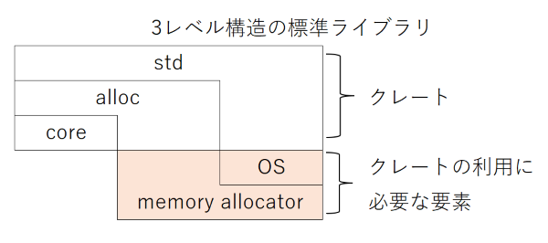

# 組み込みRustの学習ノート

## 組み込み機器向けにRustを利用するための情報

### 標準ライブラリの構造

Rustの標準ライブラリは以下の3レベル構造で提供されている。



`core`クレートと`alloc`クレートは`std`クレートのサブセットである。

最も下層の`core`クレートは前提条件なしで利用できる。ただし、整数型やスライスのようなプリミティブ型や、アトミック操作のようなプロセッサ機能を利用する処理しか提供されていない（OSやCPUといったプラットフォームに依存しない処理しか提供されていない）。

`alloc`クレートは`Box`型や`Vec`型といったヒープメモリを利用する型を提供する。`alloc`クレートを利用するには、メモリアロケーターの実装が必要となる。

`std`クレートはファイルシステムやネットワーク、スレッドといったOS機能を提供する。`println!`マクロやコマンドライン引数を渡すインターフェースも`std`クレートの役割である。`std`クレートを利用するためにはOSが必要となる。

通常は考慮不要だが、OSが載っていない組み込み機器向けにアプリケーションを作成する際には、これらを考慮しなければならない。

### unsafeブロック

FPGAボードなどを利用する際はハードウェアを直接制御することになるが、その場合「Rustコンパイラが安全でないとみなすコード」を記述する必要がある。そのために利用するのがunsafeブロックで、以下のように記述する。もちろん、記述内容の安全性は記述者であるプログラマーが保証しなければならない。

```rust
unsafe {
  // 安全でない操作を記述できる。
  // 操作の安全性はプログラマーが保障する。
}
```

なお、どんなコードでも書けるわけではなく、以下の5つの動作のみが許されている。

1. ハードウェア（メモリ）の直接操作
1. 可変なグローバル変数（static mut）へのアクセス
1. 安全でない関数（C言語の関数など）を呼び出す
1. unsafeなトレイトを実装する
1. Unionへアクセスする

メモリマップドIOを操作するために、特に1番目の操作が重要となる。

## 必要なもの

- cbindgen
  <https://github.com/eqrion/cbindgen>

[cbindgen](<https://github.com/eqrion/cbindgen>)とは、Rustで作成したライブラリをC/C++で使うためのヘッダーファイルを生成するアプリである。

よく似た名前のツールに「[bindgen](https://github.com/rust-lang/rust-bindgen)」があるが、こちらのアプリの機能は逆で、C/C++で作成したライブラリをRustで使うためのインターフェースを生成する。

## 使い方

### Rustでライブラリを作成する

まず、`cargo new embedded_rust`コマンドで組み込み機器向けライブラリのパッケージを作成する。パッケージ名は`embedded_rust`にしたが、各自で好きな名前をつければよい。

`Cargo.toml`は以下のように記述する。

```toml
# Cargo.toml
[package]
name = "embedded_rust"
version = "0.1.0"
edition = "2021"

# See more keys and their definitions at https://doc.rust-lang.org/cargo/reference/manifest.html

[dependencies]

[lib]
name = "rust_embedded"
crate-type = ["staticlib"] # ["staticlib"]で静的ライブラリ、["cdylb"]で動的ライブラリとなる。
path = "lib.rs"
```

`lib.rs`は以下のように記述する。

```rust
// lib.rs
// #![no_std]
#[no_mangle]

pub extern "C" fn r_return_value(arg: *mut u8) -> *mut u8{
    arg
}

```

準備ができ次第、`cargo build`を実行する。すると、`embedded_rust/target/x86_64-unknown-linux-gnu/libembedded_rust.a`に静的ライブラリファイルが出力される。

### cbindgenを実行し、C/C++ヘッダーファイルを生成する

基本的に <https://github.com/eqrion/cbindgen#quick-start> に従えばよい。まずは以下のコマンドでcbindgenをインストールする。

```shell
cargo install --force cbindgen
```

次に、<https://github.com/eqrion/cbindgen/blob/master/template.toml> から`cbindgen.toml`のテンプレートをダウンロードし、`embedded_rust/cbindgen.toml`へ配置する。

続いて`cbindgen.toml`を開き、`languate = "C++"`と指定している箇所を`language = "C"`に変更する。こうすることで、C言語のヘッダーファイルを出力するようになる。

```toml
# cbindgen.toml
language = "C"
```

準備完了後、以下のコマンドを実行する。すると、`embedded_rust/embedded_rust.h`が生成される。

```shell
cbindgen --config cbindgen.toml --crate embedded_rust --output embedded_rust.h
```

生成されたヘッダーファイルの中身は以下のようになっていた。

```c
// embedded_rust.h
#include <stdarg.h>
#include <stdbool.h>
#include <stddef.h>
#include <stdint.h>
#include <stdlib.h>


uint8_t *r_return_value(uint8_t *arg);
```

### C言語からRustライブラリを呼び出す

ライブラリとヘッダーファイルを生成したので、ライブラリを呼び出すC言語のアプリを作成する。まず、以下のコマンドでプロジェクトフォルダを作成し、生成したライブラリとヘッダーファイルを移動する。

```shell
# カレントディレクトリはembedded_rustディレクトリの想定。
mkdir c_bin_sample
cp ./target/x86_64-unknown-linux-gnu/debug/embedded_rust.a c_bin_sample/
cp ./embedded_rust.h c_bin_sample/
```

続いて`main.c`と`Makefile`を作成する。`main.c`は以下のように記述する。

```c
// main.c
#include <stdio.h>
#include "embedded_rust.h"

int main(int argv, char* argc[])
{
    printf("%s\n", r_return_value("Hello cbindgen world!"));
    return 0;
}
```

`Makefile`は以下のように記述する（`$(CC)`の行頭はタブで記述すること。テキストフォーマッターの影響でスペースに置換されてしまった）。

```makefile
# Makefile
CC = gcc
TARGET = call_rust_library

$(TARGET): main.c
 $(CC) -o $(TARGET) main.c embedded_rust.a
```

出来上がったC言語ソースを`make`して実行すると、以下のようにRustライブラリが動作する。

```shell
make
./call_rust_library
  → Hello cbindgen world!
```

### `extern "C"`と`#[no_mangle]`アトリビュートの指定

Rustで関数をライブラリ化してC言語から呼び出す場合、Rustの記述は以下のようにする必要がある。

```rust
#[no_mangle]
pub extern "C" fn r_10_times_value(buf: *mut i32) -> *mut i32 {
    unsafe {
        // 以下のどちらでもOK。
        // *buf = *buf * 10;
        buf.write(*buf * 10);
    }
    buf
}
```

`extern "C"`はABIの指定、つまりC言語で生成したバイナリと互換性を持たせますという意味で、`#[no_mangle]`アトリビュートはコンパイル時に関数名を変更しない・情報を追加しないという意味になる。これらのオプションを記述しなければ、C言語から関数を呼び出すことはできない。

> 参照：<https://doc.rust-jp.rs/book-ja/ch19-01-unsafe-rust.html#他の言語からrustの関数を呼び出す>
>
> 他の言語からRustの関数を呼び出す
>
> また、externを使用して他の言語にRustの関数を呼ばせるインターフェイスを生成することもできます。
> externブロックの代わりに、externキーワードを追加し、fnキーワードの直前に使用するABIを指定します。
> さらに、#[no_mangle]注釈を追加してRustコンパイラに関数名をマングルしないように指示する必要もあります。
> マングルとは、コンパイラが関数に与えた名前を他のコンパイル過程の情報をより多く含むけれども、人間に読みにくい異なる名前にすることです。
> 全ての言語のコンパイラは、少々異なる方法でマングルを行うので、Rustの関数が他の言語で名前付けできるように、
> Rustコンパイラの名前マングルをオフにしなければならないのです。

## C言語の制約

### 文字列リテラルはメモリ上の書き込み禁止領域に配置される

Rustで文字列を生成すると文字列リテラルとなり書き込み禁止領域に配置されるが、C言語で`char*`型変数に文字列をセットした場合も同様に文字列リテラルとなり、書き込み禁止領域に配置される。

そのため以下のソースを実行するとSegmentation faultが発生してしまう。

```c
#include <stdio.h>
#include <string.h>

void c_plus_one_char_literal_value(char*, size_t);

int main(void) {
    //--------------------------------------------------------------------------
    // char*型の値を書き換える。
    // 書き込み禁止領域に文字列リテラルが配置されるため、Segmentation faultが発生する。
    //--------------------------------------------------------------------------
    char* char_literal = "Hello Rust FFI world!";
    unsigned int char_literal_length = strlen(char_literal);

    printf("char* char_literal, + 1.:\n");

    printf(" %-7s", "(C)");
    printf(" %s ", char_literal);
    c_plus_one_char_literal_value(char_literal, char_literal_length);
    printf("=> %s\n", char_literal);
}

// 引数に渡された文字列リテラルの各要素の値を+1する。
void c_plus_one_char_literal_value(char* character_literal, size_t length) {
    for (size_t i = 0; i < length; i++) {
        character_literal[i] += 1;
    }
}
```

以下のように配列として宣言すれば、書き込み可能な領域に文字の配列が確保される。C言語側でバッファを確保する際、うっかり文字列リテラルのような方式にしないよう注意が必要。

```c
#include <stdio.h>
#include <string.h>

void c_plus_one_char_array_value(char*, size_t);

int main(void) {
    //-----------------------------------------------------------------
    // charの配列の値を書き換える。
    // 書き込み可能な領域に文字の配列が配置されるため、配列の値を変更できる。
    //-----------------------------------------------------------------
    char char_array[] = "Hello Rust FFI world!";
    unsigned int char_array_length = strlen(char_array);

    printf("char char_array[], + 1.:\n");

    printf(" %-7s", "(C)");
    printf(" %s ", char_array);
    c_plus_one_char_array_value(char_array, char_array_length);
    printf("=> %s\n", char_array);
}

// 引数に渡された文字列リテラルの各要素の値を+1する。
void c_plus_one_char_array_value(char* character_literal, size_t length) {
    for (size_t i = 0; i < length; i++) {
        character_literal[i] += 1;
    }
}
```

### gccのオプション

WSL2のUbuntu 20.04.5 LTSでC言語をコンパイルする場合、以下のコンパイルオプションが必要となる。

```shell
# 以下のようにヘッダーファイル、ライブラリをソースコードと同じフォルダに配置する場合。
#
#   src
#     header_sample.h
#     libsample.a
#     main.c 
gcc -o <ターゲット名> <ソースコード名> <ライブラリ名> -pthread -Wl,--no-as-needed -ldl

# 以下のようにヘッダーファイル、ライブラリをソースコードと異なるフォルダに配置する場合。
#
#   src
#     include
#       header_sample.h
#     lib
#       libsample.a
#     main.c
gcc -o <ターゲット名> -I <インクルードパス> <ソースコード名> -pthread -Wl,--no-as-needed -ldl -L <ライブラリパス> -l <ライブラリファイル名> 
```

**ソースコード名の後ろにライブラリ名を指定する**のがポイント。それぞれのコンパイルオプションの意味は、

- `-pthread`はPOSIX スレッド ライブラリとリンクするということ。
- `-Wl`はコンマ以降の指定をリンカへ渡す指定。
  - 例えば`-Wl,-Map,output.map`を指定すると、`-Map output.map`をリンカーに渡す。
  - GNU リンカを使用する場合、`-Wl,-Map=output.map`でも同じ効果が得られる。
  - `--no-as-needed`は「アプリケーションで実際に使われていない共用ライブラリであってもリンクする」という意味。
    - デフォルト動作は`--as-needed`で、「アプリケーションに実際に使われている共用ライブラリのみリンクする」という意味。
    - Ubuntu 11.10から`--as-needed`がデフォルト仕様になった。
- `-L`はライブラリファイルを配置したパスをリンカへ渡す指定。
  - `-L`コマンドで指定したパスは、`-l`コマンドで指定したライブラリファイルの検索対象になる。
- `-l`はライブラリファイル名をリンカへ渡す指定。
  - 例えば`-lm`は`libm.a`か`libm.so`を指定した扱いになる（"lib"が勝手に付与され、拡張子は無視される）。
  - そのため、`-ldl`は`libdl.a`か`libdl.so`を指定したことになる。
  - `libdl.so`をリンクしていることは確認できたが、何に使っているのかは不明。
    - 動的ライブラリのシンボル名を解決するらしいが…

実際にMakefileにすると以下のようになる。なお、フォーマッターが冒頭のタブをスペースに置き換えているかもしれない。コマンド部分の先頭はタブで始める必要があるので、コピペする際は注意すること（例えば`-@cp`の前の文字はタブ文字が正しい）。

```makefile
CC = gcc 
TARGET = call_rust_library 
SRC = main.c
INCLUDE_PATH = include
LIB_PATH = lib
LIB_FILES = rust_embedded
LDFLAGS = -pthread -Wl,--no-as-needed -ldl -L $(LIB_PATH) -l $(LIB_FILES) 

$(TARGET): main.c
 -@cp -u ../target/debug/embedded_rust.a ./lib/
 -@cp -u ../embedded_rust.h ./include/
 $(CC) -o $(TARGET) -I $(INCLUDE_PATH) $(SRC) $(LDFLAGS)

.PHONY: clean
clean:
 -@rm -f $(TARGET) $(INCLUDE_PATH)/* $(LIB_PATH)/*

```

実行ファイルに対して`ldd`コマンドを指定することで、どの共有ライブラリ（Shared Object = 動的ライブラリ）を参照しているか調べることができる。

```shell
wsluser@PC-C0204-2207-1:/mnt/c/workspace/embedded_rust$ ldd c_bin_sample/call_rust_library 
        linux-vdso.so.1 (0x00007ffd6bf68000)
        libdl.so.2 => /lib/x86_64-linux-gnu/libdl.so.2 (0x00007f84af5bf000)
        libgcc_s.so.1 => /lib/x86_64-linux-gnu/libgcc_s.so.1 (0x00007f84af5a4000)
        libpthread.so.0 => /lib/x86_64-linux-gnu/libpthread.so.0 (0x00007f84af581000)
        libc.so.6 => /lib/x86_64-linux-gnu/libc.so.6 (0x00007f84af38f000)
        /lib64/ld-linux-x86-64.so.2 (0x00007f84af717000)
```

## 具体例

## 参考資料

<https://doc.rust-lang.org/nomicon/ffi.html>
<https://dev.to/kgrech/7-ways-to-pass-a-string-between-rust-and-c-4ieb>
<https://doc.rust-jp.rs/book-ja/ch19-01-unsafe-rust.html>
<https://teratail.com/questions/360046>
<http://www.nct9.ne.jp/m_hiroi/linux/rustabc04.html>
<https://stackoverflow.com/questions/28050461/how-can-i-index-c-arrays-in-rust>
<https://stackoverflow.com/questions/29182843/pass-a-c-array-to-a-rust-function>
<https://dev.to/kgrech/7-ways-to-pass-a-string-between-rust-and-c-4ieb>
<https://michael-f-bryan.github.io/rust-ffi-guide/>
<https://rust-unofficial.github.io/patterns/idioms/ffi/passing-strings.html>
<https://qiita.com/HAMADA_Hiroshi/items/ed9305e377dc7e10fbe5>
<https://wa3.i-3-i.info/word13813.html>
<http://os.inf.tu-dresden.de/pipermail/l4-hackers/2011/005078.html>
<https://nxmnpg.lemoda.net/ja/3/dlsym>

<https://stackoverflow.com/questions/1662909/undefined-reference-to-pthread-create-in-linux>
<https://github.com/rust-lang/rust/issues/47714>
<https://stackoverflow.com/questions/20369672/undefined-reference-to-dlsym>
<https://www.gnu.org/software/make/manual/make.html>
<https://zudoh.com/linux/light-about-makefile>

1. -, Cと少しのRust, The Embedded Rust Book（日本語版）, -, <https://tomoyuki-nakabayashi.github.io/book/interoperability/rust-with-c.html>
1. eqrion and 100 Contributors, cbindgen, GitHub, 2022/11/14, <https://github.com/eqrion/cbindgen>

### 組み込みRustの資料

1. tomoyuki-nakabayashi, The Embedded Rust Book, -, -, <https://tomoyuki-nakabayashi.github.io/book/intro/index.html>
1. getditto, `safer_ffi` User Guide, -, -, <https://getditto.github.io/safer_ffi/introduction/_.html>
1. michael-f-bryan, Rust FFI Guide, -, -, <https://michael-f-bryan.github.io/rust-ffi-guide/overview.html>
1. Will Crichton, Memory Safety in Rust: A Case Study with C, &amp;notepad, 2018/02/02, <https://willcrichton.net/notes/rust-memory-safety/>
1. -, Rust Design Patterns, -, -, <https://rust-unofficial.github.io/patterns/intro.html>
1. dbrgn, Calling Rust from C and Java, -, 2017/10/31, <https://speakerdeck.com/dbrgn/calling-rust-from-c-and-java?slide=20>
