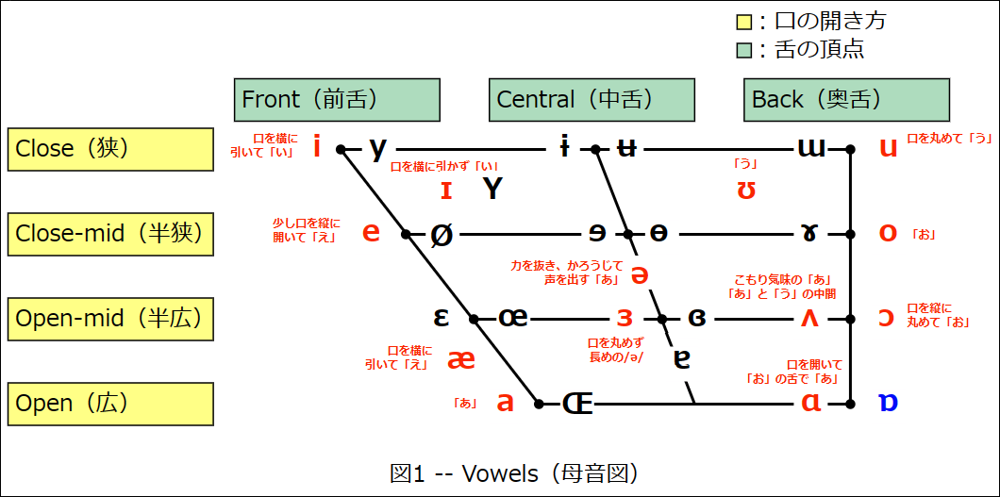

# 英語の学習ノート

## 心構え

ビジネス英語は学問ではなく訓練。
続けた人の方が上達する。筋トレと同じ。
継続しよう！

### 英語の4技能の関係性

英語の4技能「読む」・「書く」・「聞く」・「話す」の関係性を考えてみると…、

- 読めたからと言って他の3技能が成長するわけではない…。
  - 受験勉強では主に「読む」部分が問われる。
  - 大学入試共通テストではリスニングもあるけど。

そして、以下の事実がある。

- 話せれば書ける（話した言葉を文字にするので）。
  - しかし、逆は難しい。
  - 英作文ができれば話せるか？
- 聞ければ読める（聞ける言葉が文字化されるので）。
  - しかし、逆は難しい。
  - 読めれば聞き取れるか？

「逆は難しい」という点が重要で、4技能を上げるには「話す」・「聞く」を先にやった方が良い。自然と「読む」・「書く」の向上にもつながる。

```text
| 話せる | → | 書ける |
| 聞ける | → | 読める |
　　⁝
 「話す」・「聞く」を先にやる！
```

そして、「話せる音」は「聞ける音」となる。話せる音を増やしていこう。英語を口に出すこと。音読が大事。

```text
| 話せる | → | 書ける |
　　↓
| 聞ける | → | 読める | … TOEIC L/Rで問われるのはこの行の部分。「聞く」と「読む」。
```

ただし、意味を理解している英語を音読すること。
語彙と文法の知識が必要なので…、全ユニットの文法学習を先に始めよう。
ユニット1～8の文法に取り組むこと！ その過程で声に出して覚えよう。

### 英語がわかる段階について

単語の意味が分かる・聞いてわかる→文（1センテンス）読んでわかる・聞いてわかる→段落（パラグラフ）を読んでわかる・聞いてわかる。
各ユニット番号がパート番号に対応している。

文：Part1、2、5
パラグラフ：Part3、4、6、7

長い文、ちんぷんかんぷん、という状態であれば無理することはない。
短い文から無理をしないで続けていこう。

### FAQ

Q1. リスニングについていけない。単語力不足かも。
A1. Part1・2の音読から始めよう。

Q2. Unitテストや練習問題の復習について。
A2. 精読（単語や文法の確認をしながら読む）、多読（日本語に訳さなくても意味が理解できるようになるまで読む）を行ってください。テストの点数を上げることを目的にしないように！
    また、Unitテストを復習する場合、part1,2,5をまず行ってください。そして、テスト対策として1～2週間ほど日を空けて再挑戦してください。問題への判断速度が上がります。

Q3. 新しい英語が聞き取れません。どうやってなれればよいのでしょうか。英語を日本語に翻訳せずに理解するにはどうすればよいでしょう。
A3. 音読をしてください。聞くだけでは聞こえるようになりません。まずは意味を意識してから声に出して読む練習をしましょう。
    学習方法はスラッシュリーディングとシャドーイング（テキストを見ず、聞こえた音声を聞いた瞬間に声に出す訓練。中級レベルの訓練。）が良いです。

## 英語の学習法

### ディクテーション＆リピーティング

中級以下（500点以下）にお勧め

ネイティブの音声を聞いて聞こえたものを書きとる。3回ぐらい聞いて書きとれなかったら聞こえないということ。
同じところを繰り返してるとイライラしちゃうのであまりこだわりすぎないように。
音声の後について復唱する。スクリプトは見ない。さすがに初回は見てよい。
長い分は意味の塊で区切って練習してよい。

How much did it cost to send the parcel?
How much did it cost / to send the parcel? ← 区切ったバージョン。

### オーバーラッピング

意味を理解した英文を使うことが前提となる。

スクリプトを見ながら音声を聞き、自分の声を音声に重ねるように音読すること。
文章を意味で区切り、区切りごとに読んでいくとよい。自分の英語力に合わせて区切りの範囲を広げていき、その結果、読む速さが上がる。
できない場合は音声を外し、早く読む練習をするとよい。

### シャドーイング

意味を理解した英文を使うことが前提となる。

スクリプトを見ず、音声の後に続いて復唱すること。
自分で普通に音読して意味を理解して、その後にシャドーイングするとよい。

### 音読を継続するために

難しすぎるものは後回し。自分のレベル+1くらいがちょうどよい。
音読1回ごとに1単語言えるものを増やすイメージ。
音声の速さについていけない場合、まずはゆっくり読めばよい。

## 英語の発音記号（Phonetic Symbols）

ディクテーションをやってみたところ、ぜんぜん音を聞き取れなかった。読み上げが早いし、まったくついていけない。

対策が必要だと感じるので、いったん遠回りして発音記号（Phonetic Symbols）について勉強する。正式な発音を口にすることで、「音を聞く → 頭の中で発音記号をイメージする → 文字に起こす → 意味を認識する」ことができるようになるに違いない。

### 発音記号とは

発音記号は英語で Phonetic Symbols と呼び、1つの記号が1つの音を表現する。アルファベットをそのまま使っているケースもあるが、アルファベットメイトは異なる発音を意味する。

例えば、[p]は「ピー」ではない。カタカナで書くなら「プッ」という感じになる。

### 発音記号に使われる文字について

発音記号に使われる文字はIPA (International Phonetic Allphabet) が定めたものが一般に使われているらしい。文字自体の名前に興味のある人が少ないのか、非常に検索しづらかった。購入した本にも載っていなかったし（こういう発音です、という話は載っているのに、文字自体の名称が載っていない）。

過去に使われていた文字が元ネタになっているケースもあり、iotaさんのブログ記事 [発音記号の名まえ](http://toxa.cocolog-nifty.com/phonetika/2006/03/post_47ee.html) に細かい話が書かれていて勉強になる。

基本的には、

- ラテン文字と同じ記号はラテン文字と同じ名前（[a]はlower case a、[ɪ]はsmall capital I）
- ギリシャ文字など、元ネタのある文字は元ネタと同じ名前（[ɵ]はtheta、[ɛ]はepsilon）
- 文字につける記号をdiacritial markと呼ぶ。
  - [ɚ]の"~"はhookと呼ぶ。
  - [o&#x032C;]の下付きのvはsubscript wedgeと呼ぶ。
- [ː]は長音記号（length mark）。
  - ただし、日本語の長音とは違う意味があり、発音の仕方が変わる。
  - つまり、「ハッピ」を「ハッピー」と読む、みたいな話ではないのだ。
  - 長音記号は必ず長母音につく。

IPAと言っても、独立行政法人情報処理推進機構 （IPA:Information-technology Promotion Agency, Japan）ではない。

### アクセント記号（正しくは「ストレス記号」）について

母音に付与するアクセント記号は、正しくはストレス記号と呼ぶらしい。とはいえ、日本では一般的にアクセントという言葉を使っているので、この勉強メモでは気にせずアクセントと呼ぶ。

アクセント記号はIPA方式の表記と日本で一般的に使われている方式の表記があり、両方とも理解しておくとよい

表1 -- ストレス記号の表記方法

| 表記方法 | 第1アクセント | 第2アクセント |
| ---      | ---           | ---           |
| IPA方式  | /&#x2c8;ɑ/    | /&#x2cc;ɑ/    |
| 日本方式 | /ɑ&#x301;/    | /ɑ&#x300;/    |

### r音化について

標準イギリス英語と標準アメリカ英語は一定の母音の後の[r]の発音に違いがある。イギリス英語は発音せず、アメリカ英語は発音する（carはイギリス英語だと/kˈɑː/、アメリカ英語だと/kˈɑːr/となる）。

この違いを「r音化」と呼ぶ。「音化」とは、「ある音の音色を加えて発音し、その音の特徴をまとう」という意味で、一定の母音の後でrの音を発音すると考えればよい。

もともとの綴りにrがあればr音化するが、ない場合にはr音化しない。

r音化の表現にはいくつかのパターンがある。1つは/r/で表現する方法で、rがイタリック体になっている場合、それはr音化したものだとする手法である。

/kˈɑː _r_ /

もう1つは[ɝ] [ɚ]のようにフックを使う方法で、これもr音化を表す。

一般的には、

- 母音に続いてrを発音する場合は[r]を使い、
- 母音に混ざったrを発音する場合はhookを使うことが多い。

らしい。例外もあるので、完全な法則ではないけれども。

また、rとr音化は違う。carをcaと読んでも意味は変わらないが、ringをingと読むと意味が変わってしまう、といった認識で覚えよう。

### 発音記号の入力方法

以下のいずれかの方法で発音記号を入力できる。基本的に面倒くさいので、後述する表2をコピペするのが良い。

- **通常のアルファベットの発音記号**
  - 通常の半角アルファベットは普通にキーボード入力すればよい。
- **通常入力できない文字の発音記号**
  - 大抵の発音記号はutf8で実装されており、「Winキー+.」から「記号 - ラテン文字」を選べば入力できる。
- **ギリシャ文字の発音記号**
  - 発音記号で利用するのは半角文字になるため、全角入力ではなく、「Winキー+.」で入力する。例えばθとɵ、αとɑは別の文字である。
- **[ː]（長音記号、length mark）**
  - 「ちょうおん」を変換すると出てくる。
- **subscript wedgeを表現する場合**
  - `[d&#x032c;]`で[d&#x032c;]と表示できる。
- **IPA方式のアクセント記号**
  - `[&#x2c8;ɑ]`で[&#x2c8;ɑ]、`[&#x2cc;ɑ]`で[&#x2cc;ɑ]を表示できる。
- **日本方式のアクセント記号**
  - `[e&#x300;]`で[e&#x300;]、`[e&#x301;]`で[e&#x301;]と表示できる。

興味深いことに、utf8にはsubscript wedgeやアクセント記号込みの文字が用意されているようで、上記の[è]や[d̬]は1文字としてコピペすることができる。

### 音素と発音記号

音声学では、音の最小単位を「音素」と呼び、記述する際にはスラッシュで囲む。例えば、/sɪt/は3つの音素で出来ている。

発音記号は[]で囲む。先ほどの/sɪt/は[s] [ɪ] [t]と表現することになる。

### 英語の発音記号一覧

表2は[英語「発音記号」の鬼50講](https://www.amazon.co.jp/%E8%8B%B1%E8%AA%9E%E3%80%8C%E7%99%BA%E9%9F%B3%E8%A8%98%E5%8F%B7%E3%80%8D%E3%81%AE%E9%AC%BC50%E8%AC%9B-%E7%B1%B3%E5%B1%B1-%E6%98%8E%E6%97%A5%E9%A6%99-ebook/dp/B09RMWYNQ1/ref=tmm_kin_swatch_0?_encoding=UTF8&qid=&sr=)を参考に書いた、英語で登場する発音記号の一覧である。動画はこちら → <https://www.asuka-g.co.jp/dl/isbn978-4-7569-2179-6/index.html>

ただし、「本書では、IPAに準じていますが、一般により広く使われている発音記号を使います。」と書かれているので、IPAの分類を元にしつつ、その上で著者の米山明日香さんの考えを反映したもの、ということになる。

例えば、表2には「ɛ」が登場しないが、英語の発音としては存在しているようだ。

あと、発音記号の入力が大変なので、（[snippet](./file/code-snippets.txt)を用意してみた。emmet的なものがあるともっと助かるのだけれども。

表2 -- 英語で登場する発音記号一覧
| 音の分類       | No  | 記号（IPA Character）  | 記号の名前（IPA Name）                  | 説明   | フレーズ |
| ---            | --- | ---                    | ---                                     | ---    | ---      |
| 短母音         |   1 | [ɪ]                    | small capital I                         | 口を横に引かずに「い」。唇は自然な感じで、イというイメージ。「ぃや～今日も頑張った～」の「ぃ」。<br>it /ɪt/, pick /pɪk/ |
| ^              |   2 | [e]                    | lower case e                            | 日本語の「え」よりもちょっと盾に大きく口を開けて「え」。// |
| ^              |   3 | [æ]                    | ash (/ˈæʃ/ アッシュ)                    | 口を横に引いた「え」。日本語だと「あ」に置き換えられがちだが、実際の発音は全然違う。<br>cat /kæt/, apple /æpəɭ/, cap /kæp/, bad /bæd/, man /mæn/, half /hæf/ | I'm so happy! /əm sˈoʊ hˈæpi/<br>I love to dance. /ə lˈʌv tə dˈæns/<br>That's fantastic! /ðˈæts fæntˈæstiɪk/<br>The cat took a nap. /ðə kæt eɪ næp/ |
| ^              |   4 | [ɒ]                    | turned script a                         | イギリス英語のみに登場する。 |
| ^              |   5 | [ʌ]                    | turned v                                | こもりぎみの「あ」。日本語の「あ」と比べると半開き。口は緩く、舌は引き気味に。<br>green onion /griːn ʌnjən/, umbrella /ʌmbrˈelə/, cup /kʌp/ | Tough lack. /tʌf lʌk/<br>You are jumping the gun. /jʊ ər ʤˈʌmpɪŋ ðə gʌn/<br>I'm feeling under the weather. /əm fiːɭiŋ ʌndər ðə wˈeðər/ |
| ^              |   6 | [ʊ]                    | upsilon                                 | 口を尖らせないで「う」// |
| ^              |   7 | [i]                    | lower case i                            | // |
| ^              |   8 | [u]                    | lower case u                            | // |
| ^              |   9 | [ə]                    | turned e, schwa                         | 口の力を抜いて半開きにして、かろうじて声を出すくらいで「あ」。<br>クリリンが「あ…あ……」とか言ってるシーンのイメージ？<br>アクセントがないときに現れる母音。No.9とNo.10は同じ音として扱うこともある。<br>aroma /ərˈoʊmə/, banana /bənˈænə/, pajamas /pəʤˈɑməz/ | Take it easy. /tˈeɪk ət ˈiːzi/<br>It's not that difficult. /əts nɑt ðæt dˈifəkəɭt/<br>You can take your time. /jə kən tˈeɪk jə tˈaɪm/ |
| ^              |  10 | [ɚ]                    | hooked schwa (/ʃwάː/ シュワー)          | schwa  |
| 長母音         |  11 | [iː]                   | lower case i length mark                | 口を横に引いて日本語の「い」。結果的に「いぃ」みたいな感じになる。 |
| ^              |  12 | [ɑːr]                  | script a length mark lower case r       | // |
| ^              |  13 | [ɑː]                   | script a length mark                    | 口の形を「あ」にして「お」と発音すると出る音。<br>// |
| ^              |  14 | [uː]                   | lower case u length mark                | 口をとがらせて「う」。結果的に「うぅ」みたいな感じになる。// |
| ^              |  15 | [ɔː]                   | open o length mark                      | // |
| ^              |  16 | [ɔːr]                  | open o length mark lower case r         | // |
| ^              |  17 | [ɝː]                   | right hook reversed epsilon length mark | // |
| 二重母音       |  18 | [eɪ]                   | lower case e small capital I            | 日本語で「えい」。// |
| ^              |  19 | [aɪ]                   | lower case a small capital I            | 日本語で「あい」。// |
| ^              |  20 | [ɔɪ]                   | open o small capital I                  | // |
| ^              |  21 | [ɪɚ]                   | small capital I hooked schwa            | // |
| ^              |  22 | [eɚ]                   | lower case e hooked schwa               | // |
| ^              |  23 | [ʊɚ]                   | upsilon hooked schwa |
| ^              |  24 | [aʊ]                   | lower case a upsilon                    | 日本語で「あう」。
| ^              |  25 | [oʊ\|əʊ]               | lower case upsilon \| turned e upsilon  | 日本語で「おう」。「う」もきっちり発音すること。 |
| 破裂音         |  26 | [p]<br>[b]             | lower case p<br>lower case b |
| ^              |  27 | [t]<br>[d]<br>[t&#x032c;]<br>[d&#x032c;] | lower case t<br>lower case d<br> lower case t with subscript wedge (?)<br>lower case d with subscript wedge (?) |
| ^              |  28 | [k]<br>[g]             | lower case k<br>lower case g |
| 摩擦音         |  29 | [f]<br>[v]             | lower case f<br>lower case v |
| ^              |  30 | [ɵ]<br>[ð]             | theta<br>eth (/ɛð/ エズ) | ðは交差棒つきの古代文字のdが元ネタ。
| ^              |  31 | [s]<br>[z]             | lower case s<br>lower case z |
| ^              |  32 | [ʃ]<br>[ʒ]             | esh (/ˈɛʃ/ エッシュ)<br>ezh (/ˈɛʒ/ エッジュ) | ʃはイタリック体の長いs。<br>、ʒはゴシック体のzで、tailed zとも呼ぶ。 |
| ^              |  33 | [h]                    | lower case h |
| 破擦音         |  34 | [ʧ]                    | t-esh ligature | ligatureとは合字のこと。
| ^              |  35 | [ʤ]                    | d-ezh ligature |
| 鼻音           |  36 | [m]                    | lower case m |
| ^              |  37 | [n]                    | lower case n |
| ^              |  38 | [ŋ]                    | eng (/ˈɛŋ/ エング) | ŋはnに尻尾をつけたもので、tailed nとも呼ぶ。 |
| 側面音・接近音 |  39 | [ɭ]                    | right tail l
| ^              |  40 | [r]                    | lower case r |
| ^              |  41 | [w]                    | lower case w |
| ^              |  42 | [j]                    | jod (/ˈjod/ ヨッド), またはyod | ヨッド。ヘブライ語の文字が元ネタ。子音のyの音。lower case j でもよい。

まずは4種類のa = /a/, /ə/, /æ/, /ʌ/を練習するのが良いらしい？ /ɑ/は口を大きく開けて「あ」。
I got this! まかせとけ！ /aɪ gɑt ðɪs/
That's not funny. 笑えねーよ /ðæts nɑt fʌni/
This is the bomb! 最高にうまい！ /ðɪs ɪz ðə bɑm/

- /ɑ/, /æ/, /ʌ/ の例文
  <ruby>/ðˈeɚ/<rt>There</rt></ruby> <ruby>/ɪz/<rt>is</rt></ruby> <ruby>/ðə/<rt>the</rt></ruby> <ruby>/kɑp/<rt>cop</rt></ruby> <ruby>/wìð/<rt>with</rt></ruby> <ruby>/ðə/<rt>the</rt></ruby> <ruby>/kæp/<rt>cap</rt></ruby> <ruby>/ɔːn/<rt>on</rt></ruby> <ruby>/ðə/<rt>the</rt></ruby> <ruby>/kˈʌp/<rt>cup</rt></ruby>.

<https://qr.ae/pyBsdN>
<https://www.youtube.com/@SoundsAmerican>

母音表は外側に行くほどはっきりした音になる。内側の音は緩め。
短母音の音(1)、長母音か二重母音の(2)。

| - | (1) | (2) |
| --- | --- | --- |
| a | æ | ei |
| i | ɪ | ai |
| u | ʌ | juː |
| e | e | iː |
| o | ɑ | oʊ |

### 英語の母音発声時の舌の位置

図1は[東京外語大の提供する母音図](http://www.coelang.tufs.ac.jp/ipa/vowel.php)を参考に描いた母音図で、記号が対にになっているところは右側のものが円唇母音を表す。円唇母音とは、唇を円形にすぼめて発音する音のこと。

赤字は「表2 -- 英語で登場する発音記号一覧」で登場した「英語で使う発音記号」を示している。

ただ、母音図は教科書によりかなり差があるらしい。[【母音図で図解！】英語の母音の舌の位置一覧](https://lion-eigo.com/pronunciation/tongue-position/) で検証されており、結果を見ると、確かに意外と細かく違っている。

[](./img/Vowels.svg)

<!--
この画像は頑張ってSVGで描いた画像だが、GitHubのmarkdownをプレビューしてもsvg画像が表示されない。仕方がないので、png化した画像を表示している。テキスト検索できなくなってしまうので、とても残念だ。リンク先の画像はsvgファイルである。
-->

## 日本語の母音発声時の舌の位置

図2は日本語の母音発声時の舌の位置を母音図へプロットしたもの。しっかり声を出してみると、なんとなくわかる気がしてくる。

こちらの母音図は[発音記号キャラ辞典](https://www.amazon.co.jp/%E7%99%BA%E9%9F%B3%E8%A8%98%E5%8F%B7%E3%82%AD%E3%83%A3%E3%83%A9%E8%BE%9E%E5%85%B8-Dacci-%E8%8B%B1%E8%AA%9E%E7%89%A9%E8%AA%9E-ebook/dp/B07N1B9YWB/ref=tmm_kin_swatch_0?_encoding=UTF8&qid=&sr=)で紹介されていた画像をもとに描いたもので、[【母音図で図解！】英語の母音の舌の位置一覧](https://lion-eigo.com/pronunciation/tongue-position/)を見ると、やはり差がある。

特に「う」は、この図よりも中舌寄りかもしれない。

[](./img/Japanese_Vowels.svg)

## 参考資料

1. 米山明日香, 英語「発音記号」の鬼50講, 明日香出版社, 2022/01/14 第8刷, ISBN:978-4-7569-2179-6
1. Dacci from 英語物語・リチャード川口, 発音記号キャラ辞典, 株式会社KADOKAWA, 2019/01/26, ASIN:B07N1B9YWB
1. qvarie, フック付き【シュワー】, 世界の特殊文字wiki, 2010/02/18, <https://seesaawiki.jp/w/qvarie/d/%A5%D5%A5%C3%A5%AF%C9%D5%A4%AD%A1%DA%A5%B7%A5%E5%A5%EF%A1%BC%A1%DB>
1. ルーミン / Baudanbau20, IPA拡張, wikipedia, 2023/08/14, <https://ja.wikipedia.org/wiki/IPA拡張>
1. iota, 発音記号の名前, phonetika /p&#x2b0;ɔːnɛːtika&#x301;/, 2013/06/27, <http://toxa.cocolog-nifty.com/phonetika/2006/03/post_47ee.html>
1. 高橋 誠, UnicodeのIPA発音記号の一覧, 2009/05/25, 鈴木朝子と高橋誠の部屋, <http://hobbit.ddo.jp/html/ipa.html>
1. Simone Westermann, International Phonetic Alphabet, geonames.de, -, <https://www.geonames.de/ipa.html>
1. 福田泰裕, Googleドキュメントの音声入力を用いた英語のスピーキング活動, 高校教師とICTのブログ [数学x情報xICT], 2021/09/01, <https://www.fy1203.com/2021/09/01/voice-input-speaking/>
1. 東京外国語大学, ＩＰＡ　国際音声字母（記号）, 東外大言語モジュール, -, <http://www.coelang.tufs.ac.jp/ipa/vowel.php>
1. サラ, 【母音図で図解！】英語の母音の舌の位置一覧, らいトレ, 2023/05/02, <https://lion-eigo.com/pronunciation/tongue-position/>
1. <https://kotobank.jp/word/円唇母音-447780#:~:text=〘名〙%20唇をまるめること,非円唇である。>
1. 河内山 真理, 有本 純, 日本における発音記号の扱いに関する問題 : 辞典と教科書, NDL ONLINE, 2022/03, <https://ndlonline.ndl.go.jp/#!/detail/R300000002-I032196813-00>
1. 関西国際大学総合研究所, CiNii, 2008/03, <https://ci.nii.ac.jp/ncid/AA12321947?lang=ja>
1. 河内山 真理, 有本 純, 日本における発音記号の扱いに関する問題 : 辞典と教科書, 関西国際大学 メディアライブラリー, 2022/03, <https://kuins.repo.nii.ac.jp/record/1087/files/K15-9%20KOCHIYAMA.pdf>
1. Kwamikagami / TLJ7863 / Drmccreedy / Streapadair / R'n'B / Duck Gang II / Spitzak / Arjayay / , Unicode subscripts and superscripts, Wikipedia, 2023/08/08, <https://en.wikipedia.org/wiki/Unicode_subscripts_and_superscripts>
1. 旺文社, 発音記号の読み方と覚え方, 英語の友, 2019/05/17, <https://eigonotomo.com/4skills/hatsuon>
