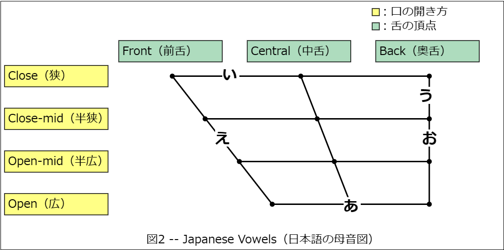

# 英語の学習ノート

## 心構え

ビジネス英語は学問ではなく訓練。
続けた人の方が上達する。筋トレと同じ。
継続しよう！

### 英語の4技能の関係性

英語の4技能の関係性
読む・書く・聞く・話す

読めたからと言って他の3技能が成長するわけではない…。

話せれば書ける（話した言葉を文字にするので）。逆は難しい（英作文ができるけど話せるか？）
聞ければ読める（聞ける言葉が文字化されるので）。逆は難しい（読めるけど聞き取れない）

話せる → 書ける
聞ける → 読める

4技能を上げるには「話す」・「聞く」を先にやった方が良い。
TOEIC L/R は聞くと読むの部分。

言える音 = 聞こえる音
これを伸ばしていこう。口に出すこと。
ただし、意味を理解している英語を音読すること。
語彙と文法の知識が必要なので…、全ユニットの文法学習を先に始めよう。
ユニット1～8の文法に取り組むこと！ その過程で声に出して覚えよう。

### 英語がわかる段階について

単語の意味が分かる・聞いてわかる→文（1センテンス）読んでわかる・聞いてわかる→段落（パラグラフ）を読んでわかる・聞いてわかる。
各ユニット番号がパート番号に対応している。

文：Part1、2、5
パラグラフ：Part3、4、6、7

長い文、ちんぷんかんぷん、という状態であれば無理することはない。
短い文から無理をしないで続けていこう。

### FAQ

Q1. リスニングについていけない。単語力不足かも。
A1. Part1・2の音読から始めよう。

Q2. Unitテストや練習問題の復習について。
A2. 精読（単語や文法の確認をしながら読む）、多読（日本語に訳さなくても意味が理解できるようになるまで読む）を行ってください。テストの点数を上げることを目的にしないように！
    また、Unitテストを復習する場合、part1,2,5をまず行ってください。そして、テスト対策として1～2週間ほど日を空けて再挑戦してください。問題への判断速度が上がります。

Q3. 新しい英語が聞き取れません。どうやってなれればよいのでしょうか。英語を日本語に翻訳せずに理解するにはどうすればよいでしょう。
A3. 音読をしてください。聞くだけでは聞こえるようになりません。まずは意味を意識してから声に出して読む練習をしましょう。
    学習方法はスラッシュリーディングとシャドーイング（テキストを見ず、聞こえた音声を聞いた瞬間に声に出す訓練。中級レベルの訓練。）が良いです。

## 英語の学習法

### ディクテーション＆リピーティング

中級以下（500点以下）にお勧め

ネイティブの音声を聞いて聞こえたものを書きとる。3回ぐらい聞いて書きとれなかったら聞こえないということ。
同じところを繰り返してるとイライラしちゃうのであまりこだわりすぎないように。
音声の後について復唱する。スクリプトは見ない。さすがに初回は見てよい。
長い分は意味の塊で区切って練習してよい。

How much did it cost to send the parcel?
How much did it cost / to send the parcel? ← 区切ったバージョン。

### オーバーラッピング

意味を理解した英文を使うことが前提となる。

スクリプトを見ながら音声を聞き、自分の声を音声に重ねるように音読すること。
文章を意味で区切り、区切りごとに読んでいくとよい。自分の英語力に合わせて区切りの範囲を広げていき、その結果、読む速さが上がる。
できない場合は音声を外し、早く読む練習をするとよい。

### シャドーイング

意味を理解した英文を使うことが前提となる。

スクリプトを見ず、音声の後に続いて復唱すること。
自分で普通に音読して意味を理解して、その後にシャドーイングするとよい。

### 音読を継続するために

難しすぎるものは後回し。自分のレベル+1くらいがちょうどよい。
音読1回ごとに1単語言えるものを増やすイメージ。
音声の速さについていけない場合、まずはゆっくり読めばよい。

## 英語の発音記号

正直ぜんぜん音を聞き取れないので、いったん遠回りして発音記号について勉強する。
頭の中で発音記号をイメージできれば、きっと口にも出せるだろう。

ラテン文字と同じ記号はラテン文字と同じ名前（[a]はlower-case a、[I]はcapital I）
ギリシャ文字など、元ネタのある文字は元ネタと同じ名前（[θ]はtheta、[ε]はepsilon）

大抵の発音記号は「Winキー+.」から「ラテン文字」を選べば入力できる。
[ː]は長音記号。この文字は「ちょうおん」を変換すると出てくる。

文字につける記号をdiacritial markと呼ぶ。
[ɚ]の"~"をhook、[o&#x032C;]のvをsubscript wedgeと呼ぶ。

unicodeでsubscript wedgeを表現する場合、`[d&#x032c;]`と入力すると[d&#x032c;]と表示できる。
アクセント記号は、`[e&#x300;]`で[e&#x300;]、`[e&#x301;]`で[e&#x301;]と表示できる。

IPA (International Phonetic Allphabet)
 "Handbook of the international Phonetic Association: A Guide to the Use of the International Phonetic Alphabet" 国際音声ハンドブック

### 英語の発音記号一覧

表1 -- 英語の発音記号一覧
| 音の分類 | No  | 記号   | 記号の名前         | 記号の名前の読み方 |
| ---      | --- | ---    | ---                | ---    |
| 短母音   |   1 | [ɪ]    | small capital I    | // |
| ^        |   2 | [e]    | lower case e       | // |
| ^        |   3 | [æ]    | ash                | // アッシュ |
| ^        |   4 | [ɒ]    | turned script a    | // |
| ^        |   5 | [ʌ]    | turned v           | // |
| ^        |   6 | [U]    | capital U          | // |
| ^        |   7 | [i]    | lower case i       | // |
| ^        |   8 | [u]    | lower case u       | // |
| ^        |   9 | [ə]    | turned e           | // |
| ^        |  10 | [ɚ]    | schwa with hook    | // シュワー |
| 長母音   |  11 | [iː]   | lower case i       | // |
| ^        |  12 | [ɑːr]  | script a r (???) | // |
| ^        |  13 | [ɑː]   | script a              | // |
| ^        |  14 | [uː]   | lower case u       | // |
| ^        |  15 | [ɔː]   | open o             | // |
| ^        |  16 | [ɔːr]  | open o lower case r (???) | // |
| ^        |  17 | [ɝː]   | ezh with hook                | // エッジュ with hook |
| 二重母音 |  18 | [eɪ]   | lower case e smapp capital I | // |
| ^        |  19 | [aɪ]
| ^        |  20 | [ɔɪ]
| ^        |  21 | [ɪɚ]
| ^        |  22 | [eɚ]
| ^        |  23 | [ʊɚ]   | turned omega schwa with hook |
| ^        |  24 | [aʊ]
| ^        |  25 | [oʊ\|əʊ]
| 破裂音   |  26 | [p] [b]
| ^        |  27 | [t] [d] [t&#x032c;] [d&#x032c;] | subscript wedge
| ^        |  28 | [k] [g]
| 摩擦音   |  29 | [f] [v]
| ^        |  30 | [ɵ] [ð] | theta, eth | シータ、エズ（交差棒つきの古代文字のd）
| ^        |  31 | [s] [z]
| ^        |  32 | [ʃ] [ʒ] | esh, ezh | エッシュ（イタリック体の長いS）、エッジュ（ゴシック体のz、tailed zとも呼ぶ）
| ^        |  33 | [h]
| 破擦音   |  34 | [ʧ] | t-esh ligature | ligatureとは合字のこと。
| ^        |  35 | [ʤ] | d-ezh ligature |
| 鼻音     |  36 | [m]
| ^        |  37 | [n]
| ^        |  38 | [ŋ] | eng | エング（nに尻尾をつけたもの）
| 側面音・接近音 | 39 | [ɭ] | L？
| ^              | 40 | [r]
| ^              | 41 | [w]
| ^              | 42 | [j] | jod/yod | ヨッド。ヘブライ語の文字が元ネタ。子音のyの音。lower case j でもよい。

### 英語の母音発声時の舌の位置

赤字は英語で登場する発音記号。記号が対にになっているところは右側のものが円唇母音を表す。頑張ってSVGで描いた画像だが、GitHubのmarkdownをプレビューしてもsvg画像が表示されないので、png化したものをリンクする。


<details>
```
@Vowels.svg
<?xml version="1.0" encoding="UTF-8" standalone="yes"?>
<svg xmlns="http://www.w3.org/2000/svg" style="width:675px; height:350px; border-style:solid; border-width: 1px;">
  <!-- 凡例 -->
  <rect x="520" y="10" width="10" height="10" style="stroke: #000000; fill: #ffff77;"/>
  <text x="530" y="20" style="text-anchor: start">：口の開き方</text>
  <rect x="520" y="30" width="10" height="10" style="stroke: #000000; fill: #aaddbb;"/>
  <text x="530" y="40" style="text-anchor: start">：舌の頂点</text>
  <rect x="5" y="90" width="145" height="30" style="stroke: #000000; fill: #ffff77;"/>
  <!-- 見出し（口の開き方） -->
  <text x="10" y="110" style="text-anchor: start">Close（狭）</text>
  <rect x="5" y="150" width="145" height="30" style="stroke: #000000; fill: #ffff77;"/>
  <text x="10" y="170" style="text-anchor: start">Close-mid（半狭）</text>
  <rect x="5" y="210" width="145" height="30" style="stroke: #000000; fill: #ffff77;"/>
  <text x="10" y="230" style="text-anchor: start">Open-mid（半広）</text>
  <rect x="5" y="270" width="145" height="30" style="stroke: #000000; fill: #ffff77;"/>
  <text x="10" y="290" style="text-anchor: start;">Open（広）</text>
  <rect x="165" y="55" width="145" height="30" style="stroke: #000000; fill: #aaddbb;"/>
  <!-- 見出し（舌の位置） -->
  <text x="170" y="75" style="text-anchor: start">Front（前舌）</text>
  <rect x="345" y="55" width="145" height="30" style="stroke: #000000; fill: #aaddbb;"/>
  <text x="350" y="75" style="text-anchor: start">Central（中舌）</text>
  <rect x="525" y="55" width="145" height="30" style="stroke: #000000; fill: #aaddbb;"/>
  <text x="530" y="75" style="text-anchor: start">Back（奥舌）</text>
  <!-- Close（狭）の横線 -->
  <line x1="240" y1="105" x2="600" y2="105" style="stroke:#000000; stroke-width: 2px;" />
  <circle cx="240" cy="105" r="3" style="stroke:#000000; fill: #000000;"/>
  <circle cx="420" cy="105" r="3" style="stroke:#000000; fill: #000000;"/>
  <circle cx="600" cy="105" r="3" style="stroke:#000000; fill: #000000;"/>
  <!-- Close-mid（半狭）の横線 -->
  <line x1="286" y1="165" x2="600" y2="165" style="stroke:#000000; stroke-width: 2px;" />
  <circle cx="286" cy="165" r="3" style="stroke:#000000; fill: #000000;"/>
  <circle cx="443" cy="165" r="3" style="stroke:#000000; fill: #000000;"/>
  <circle cx="600" cy="165" r="3" style="stroke:#000000; fill: #000000;"/>
  <!-- Close-mid（半広）の横線 -->
  <line x1="334" y1="225" x2="600" y2="225" style="stroke:#000000; stroke-width: 2px;" />
  <circle cx="334" cy="225" r="3" style="stroke:#000000; fill: #000000;"/>
  <circle cx="467" cy="225" r="3" style="stroke:#000000; fill: #000000;"/>
  <circle cx="600" cy="225" r="3" style="stroke:#000000; fill: #000000;"/>
  <!-- Open（広）の横線 -->
  <line x1="380" y1="285" x2="600" y2="285" style="stroke:#000000; stroke-width: 2px;" />
  <circle cx="380" cy="285" r="3" style="stroke:#000000; fill: #000000;"/>
  <circle cx="600" cy="285" r="3" style="stroke:#000000; fill: #000000;"/>
  <!-- Close（狭）,Front（前舌）からOpen（広）,Central（中舌）への縦線 -->
  <line x1="240" y1="105" x2="380" y2="285" style="stroke: #000000; stroke-width: 2px;"/>
  <!-- Close（狭）,Central（中舌）からOpen（広）,Central（中舌）への縦線 -->
  <line x1="420" y1="105" x2="490" y2="285" style="stroke: #000000; stroke-width: 2px;"/>
  <!-- Close（狭）,Back（奥舌）からOpen（広）,Back（奥舌）への縦線 -->
  <line x1="600" y1="105" x2="600" y2="285" style="stroke: #000000; stroke-width: 2px;"/>
  <!-- 発音記号 Close（狭）,Front（前舌）-->
  <rect x="210" y="90" width="1.5em" height="1.5em" style="fill: #ffffff;" />
  <text x="220" y="110" style="font-size: 1.3em; font-weight: bold; fill: #ff0000;">i</text>
  <rect x="255" y="90" width="1.5em" height="1.5em" style="fill: #ffffff;" />
  <text x="260" y="110" style="font-size: 1.3em; font-weight: bold; fill: #000000;">y</text>
  <!-- 発音記号 Close（狭）,Central（中舌）-->
  <rect x="385" y="90" width="1.5em" height="1.5em" style="fill: #ffffff;" />
  <text x="395" y="110" style="font-size: 1.3em; font-weight: bold; fill: #000000;">ɨ</text>
  <rect x="430" y="90" width="1.5em" height="1.5em" style="fill: #ffffff;" />
  <text x="435" y="110" style="font-size: 1.3em; font-weight: bold; fill: #000000;">ʉ</text>
  <!-- 発音記号 Close（狭）,Back（奥舌）-->
  <rect x="560" y="90" width="1.5em" height="1.5em" style="fill: #ffffff;" />
  <text x="562" y="110" style="font-size: 1.3em; font-weight: bold; fill: #000000;">ɯ</text>
  <rect x="615" y="90" width="1.5em" height="1.5em" style="fill: #ffffff;" />
  <text x="620" y="110" style="font-size: 1.3em; font-weight: bold; fill: #ff0000;">u</text>
  <!-- 発音記号 Close（狭）とClose-mid（半狭）の中間,Front（前舌）とCentral（中舌）の中間 -->
  <rect x="310" y="120" width="1.5em" height="1.5em" style="fill: #ffffff;" />
  <text x="310" y="140" style="font-size: 1.3em; font-weight: bold; fill: #ff0000;">ɪ</text>
  <rect x="335" y="120" width="1.5em" height="1.5em" style="fill: #ffffff;" />
  <text x="340" y="140" style="font-size: 1.3em; font-weight: bold; fill: #000000;">Y</text>
  <!-- 発音記号 Close（狭）とClose-mid（半狭）の中間,Central（中舌）とBack（奥舌）の中間 -->
  <rect x="515" y="120" width="1.5em" height="1.5em" style="fill: #ffffff;" />
  <text x="520" y="140" style="font-size: 1.3em; font-weight: bold; fill: #ff0000;">ʊ</text>
  <!-- 発音記号 Close-mid（半狭）,Front（前舌） -->
  <rect x="250" y="155" width="1.5em" height="1.5em" style="fill: #ffffff;" />
  <text x="255" y="170" style="font-size: 1.3em; font-weight: bold; fill: #ff0000;">e</text>
  <rect x="300" y="155" width="1.5em" height="1.5em" style="fill: #ffffff;" />
  <text x="303" y="173" style="font-size: 1.3em; font-weight: bold; fill: #000000;">Ø</text>
  <!-- 発音記号 Close-mid（半狭）,Central（中舌） -->
  <rect x="410" y="155" width="1.5em" height="1.5em" style="fill: #ffffff;" />
  <text x="415" y="170" style="font-size: 1.3em; font-weight: bold; fill: #000000;">ɘ</text>
  <rect x="455" y="155" width="1.5em" height="1.5em" style="fill: #ffffff;" />
  <text x="458" y="170" style="font-size: 1.3em; font-weight: bold; fill: #ff0000;">ɵ</text>
  <!-- 発音記号 Close-mid（半狭）,Back（奥舌） -->
  <rect x="560" y="155" width="1.5em" height="1.5em" style="fill: #ffffff;" />
  <text x="565" y="170" style="font-size: 1.3em; font-weight: bold; fill: #000000;">ɤ</text>
  <rect x="615" y="155" width="1.5em" height="1.5em" style="fill: #ffffff;" />
  <text x="620" y="170" style="font-size: 1.3em; font-weight: bold; fill: #000000;">o</text>
  <!-- 発音記号 Close-mid（半狭）とOpen-mid（半広）の中間,Central（中舌） -->
  <rect x="440" y="180" width="1.5em" height="1.5em" style="fill: #ffffff;" />
  <text x="445" y="200" style="font-size: 1.3em; font-weight: bold; fill: #000000;">ə</text>
  <!-- 発音記号 Open-mid（半広）,Front（前舌） -->
  <rect x="300" y="215" width="1.5em" height="1.5em" style="fill: #ffffff;" />
  <text x="305" y="230" style="font-size: 1.3em; font-weight: bold; fill: #000000;">ɛ</text>
  <rect x="350" y="215" width="1.5em" height="1.5em" style="fill: #ffffff;" />
  <text x="351" y="230" style="font-size: 1.3em; font-weight: bold; fill: #000000;">œ</text>
  <!-- 発音記号 Open-mid（半広）,Central（中舌） -->
  <rect x="430" y="215" width="1.5em" height="1.5em" style="fill: #ffffff;" />
  <text x="435" y="230" style="font-size: 1.3em; font-weight: bold; fill: #000000;">ɜ</text>
  <rect x="480" y="215" width="1.5em" height="1.5em" style="fill: #ffffff;" />
  <text x="485" y="230" style="font-size: 1.3em; font-weight: bold; fill: #000000;">ɞ</text>
  <!-- 発音記号 Open-mid（半広）,Back（奥舌） -->
  <rect x="560" y="215" width="1.5em" height="1.5em" style="fill: #ffffff;" />
  <text x="565" y="230" style="font-size: 1.3em; font-weight: bold; fill: #ff0000;">ʌ</text>
  <rect x="615" y="215" width="1.5em" height="1.5em" style="fill: #ffffff;" />
  <text x="620" y="230" style="font-size: 1.3em; font-weight: bold; fill: #ff0000;">ɔ</text>
  <!-- 発音記号 Open-mid（半広）とOpen（広）の中間,Front（前舌） -->
  <rect x="315" y="245" width="1.5em" height="1.5em" style="fill: #ffffff;" />
  <text x="315" y="260" style="font-size: 1.3em; font-weight: bold; fill: #ff0000;">æ</text>
  <!-- 発音記号 Open-mid（半広）とOpen（広）の中間,Central（中舌） -->
  <rect x="470" y="245" width="1.5em" height="1.5em" style="fill: #ffffff;" />
  <text x="475" y="260" style="font-size: 1.3em; font-weight: bold; fill: #000000;">ɐ</text>
  <!-- 発音記号 Open（広）,Front（前舌） -->
  <rect x="345" y="275" width="1.5em" height="1.5em" style="fill: #ffffff;" />
  <text x="350" y="290" style="font-size: 1.3em; font-weight: bold; fill: #ff0000;">a</text>
  <rect x="395" y="275" width="1.5em" height="1.5em" style="fill: #ffffff;" />
  <text x="396" y="292" style="font-size: 1.3em; font-weight: bold; fill: #000000;">Œ</text>
  <!-- 発音記号 Open（広）,Central（中舌）…この分類については該当なし -->
  <!-- 発音記号 Open（広）,Back（奥舌） -->
  <rect x="560" y="275" width="1.5em" height="1.5em" style="fill: #ffffff;" />
  <text x="565" y="290" style="font-size: 1.3em; font-weight: bold; fill: #ff0000;">ɑ</text>
  <rect x="615" y="275" width="1.5em" height="1.5em" style="fill: #ffffff;" />
  <text x="620" y="290" style="font-size: 1.3em; font-weight: bold; fill: #ff0000;">ɒ</text>
  <text x="337" y="340" style="text-anchor: middle;">図1 -- Vowels（母音図）</text>
</svg>
@Vowels.svg
```
</details>

## （参考）日本語の母音発声時の舌の位置

図2は日本語の母音発声時の舌の位置を母音図へプロットしたもの。しっかり声を出してみると、なんとなくわかる気がしてくる。



<https://seesaawiki.jp/w/qvarie/d/%A5%D5%A5%C3%A5%AF%C9%D5%A4%AD%A1%DA%A5%B7%A5%E5%A5%EF%A1%BC%A1%DB>
<https://ja.wikipedia.org/wiki/IPA%E6%8B%A1%E5%BC%B5>
<http://toxa.cocolog-nifty.com/phonetika/2006/03/post_47ee.html>
<http://hobbit.ddo.jp/html/ipa.html>
<https://www.geonames.de/ipa.html>
<https://www.fy1203.com/2021/09/01/voice-input-speaking/>
<http://www.coelang.tufs.ac.jp/ipa/vowel.php>
<https://lion-eigo.com/pronunciation/tongue-position/>
<https://kotobank.jp/word/円唇母音-447780#:~:text=〘名〙%20唇をまるめること,非円唇である。>
<https://ndlonline.ndl.go.jp/#!/detail/R300000002-I032196813-00>
<https://ci.nii.ac.jp/ncid/AA12321947?lang=ja>
<https://kuins.repo.nii.ac.jp/record/1087/files/K15-9%20KOCHIYAMA.pdf>
Dacci from 英語物語・リチャード川口, 発音記号キャラ辞典, 株式会社KADOKAWA, 2019/01/26, ASIN:B07N1B9YWB
