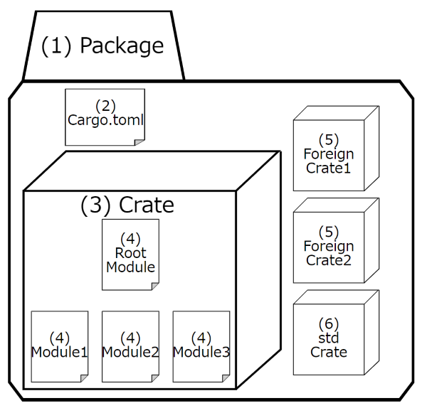
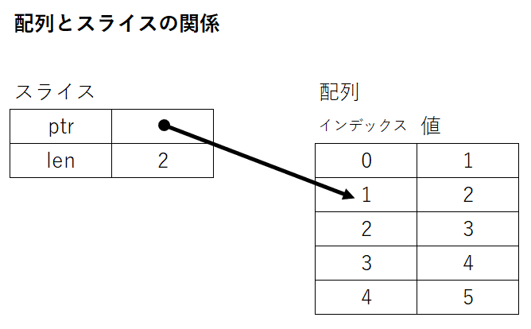

# Rustの学習ノート

## Rust開発環境の構築方法

### 必要なもの

以下のサイトから必要なものをダウンロードし、インストールする。

- [Rust公式サイト](https://www.rust-lang.org/ja)
- [Visual Studio Code](https://azure.microsoft.com/ja-jp/products/visual-studio-code/)、および以下の拡張機能
  - rust-analyzer（作者：The Rust Programming Language）
  - CodeLLDB（作者：Vadim Chugunov）

### Rustツールチェインのインストール手順

ツールチェインとは「ソフトウェア開発に必要な一連のツールセット」のことを言い、Rustツールチェインには

- Rustコンパイラ（rustc）
- ビルドツール兼パッケージマネージャー（Cargo）
- コンパイル済み標準ライブラリ など

が含まれる。

#### リンカのインストール

RustコンパイラはCコンパイラのリンカを利用するため、Rustをインストールする前にCコンパイラのリンカをインストールしなければならない。

LinuxでRustを利用する場合、以下のコマンドでCコンパイラをインストールすれば、同時にリンカもインストールできる。

```shell
# LinuxにRustをインストールする場合、Cコンパイラをインストールする。
$ sudo apt install build-essential
```

WindowsでRustを利用する場合、Rustのインストール時にVisual Studioを同時にインストールできるので、事前になにか行う必要はない（ただし、普通にインストールできない環境では公式サイトの特別な手順に従わなければならない）。

#### Rustツールチェインのインストール

公式サイトからRustツールチェインをダウンロードし、インストールする。

- Install Rust
  <https://www.rust-lang.org/ja/tools/install>

Windowsの場合、`rustup-init.exe`を実行して指示に従えばよい。

ただし、何も考えずにインストールを進めると、同時にVisual Studio 2022をインストールすることになる。個人でRustを使うのであればCommunity版を利用すればよいが、会社等で利用するのであれば「Visual Studio C++ Build tools」を利用する方法でインストールしなければならないだろう。

#### クロスビルドツールチェインのインストール

必要に応じてクロスビルド用のツールチェインをインストールする。例えば、Linux向けのAARCH64をターゲットにしたければ、以下のように`rustup`コマンドを実行すればよい。

```shell
# ターゲットを追加するコマンド。
$ rustup target add aarch64-unknown-linux-gnu
```

追加可能なターゲットは`rustup target list`で表示できる。

コマンドのヘルプは`rustup --help`で表示できるが、より詳しく`rustup`について知りたいのであれば [The rustup book](https://rust-lang.github.io/rustup/index.html) を参照すること。

#### Visual Studio Codeのインストール

エディタとしてVisual Studio Codeをインストールする。そして、以下の拡張機能をインストールすれば、Rustの環境構築は完了である。

- [Visual Studio Code](https://azure.microsoft.com/ja-jp/products/visual-studio-code/)、および以下の拡張機能
  - rust-analyzer（作者：The Rust Programming Language）
  - CodeLLDB（作者：Vadim Chugunov）

## cargoの使い方

cargoとは、Rustのビルドツール、およびパッケージマネージャーのこと。色々できるので、主だったところを紹介する。

| cargoコマンド | 効果 |
| --- | --- |
| `cargo new [オプション] <フォルダ名>` | 指定したフォルダを新規作成し、パッケージを構築する。 オプション指定なしだとバイナリクレート、`--lib`を指定するとライブラリクレートのパッケージとなる。 |
| `cargo init [オプション] <フォルダ名>` | 指定したフォルダへパッケージを構築する。 オプション指定なしだとバイナリクレート、`--lib`を指定するとライブラリクレートのパッケージとなる。 |
| `cargo check` | ソースコードの内容をチェックし、コンパイルエラーがあれば表示する。 |
| `cargo build` | ソースコードをビルドする。 |
| `cargo run` | ソースコードをビルドし、出来上がった実行可能ファイルを実行する。 |
| `cargo test [テスト名]` | テストを実行する。 |
| `cargo doc` | パッケージのドキュメントを出力する。 |

これらに加えてサブコマンド（`cargo install cargo-generate`のようなもの）まである。とりあえず、「何か色々できるのだなあ」と認識しておけばよいだろう。

cargo、およびCargo.tomlの説明資料は以下の通り。

- The Cargo Book
  <https://doc.rust-lang.org/cargo/>
- The Manifest Format
  <https://doc.rust-lang.org/cargo/reference/manifest.html>

また、cargoの設定ファイルを`プロジェクト/.cargo/config.toml`に配置することができる。

## プロジェクト（パッケージ）の構成

Rustのプロジェクト（パッケージ）は以下の構成をとる。

| No | 用語 | 意味 |
| --- | --- | --- |
| (1) | パッケージ | クレートのビルド・テスト・共有を可能にするためのCargoの単位のこと。最大で1つのライブラリクレートと複数のバイナリクレートを持つことができる。 |
| (2) | Cargo.toml | パッケージのメタデータや、パッケージをビルドするために必要な外部クレートへの依存関係を記述する。 パッケージのマニフェストと呼ばれる。 |
| (3) | クレート | パッケージに1つのまとまりの機能を提供する単位で、ルートモジュールをトップとしたモジュールのツリーのこと。 ルートモジュールが`main.rs`であれば実行バイナリ、それ以外の場合はライブラリを構成する。 |
| (4) | モジュール | クレート内でプログラムを構造化したもの。構造体や関数などのスコープや可視性を制御する。 |
| (5) | 外部クレート | 主に [crates.io](https://crates.io/) で公開されているクレートのこと。 |
| (6) | stdクレート | Rustの標準ライブラリを提供するクレートのこと。 |



### （TODO）dependenciesについて

| 記述例 | 意味 | 補足説明 |
| --- | --- | --- |
| `1.2.3` / `^1.2.3` | 1.2.3 <= v < 2.0.0 | `0.1.0`の場合は 0.1.0 <= v < 0.2.0 となるっぽい。 |
| `~1.2` | 1.2.0 <= v < 1.3.0 | - |
| `1.*` | 1.0.0 <= v < 2.0.0 | - |
| `=1.2.3` | 1.2.3 = v | - |
| `>1.1` | 1.2.0 <= v | - |
| `>=1.2,<1.5` | 1.2.0 <= v < 1.5.0 | - |

- The Cargo Book - 3.14. Dependency Resolution
  <https://doc.rust-lang.org/cargo/reference/resolver.html>
- The Cargo Book - 3.1.1. Overriding Dependencies
  <https://doc.rust-lang.org/cargo/reference/overriding-dependencies.html>

## Rustの文法

文 = statement、式 = expressoin。式は値を返す。";"を末尾に付与すると文として扱われる。

### let, const, static

#### 変数

```rust
let 変数名[:型] = 値;
let mut 変数名[:型][ = 値];
```

`let`文で値を変数に束縛する（C言語等では「値を変数に代入する」と表現するが、Rustでは「値を変数に束縛する」と言う）。束縛 = bind、代入 = assign。

変数はデフォルトでイミュータブル（immutable：後から変更できない）で、変更可能な変数を利用する場合はキーワード`mut`を付与した`let mut`文で変数を束縛すればよい。

変数の型はRustコンパイラが型推論して決定する。そのため、明示しなくてもよい。ただし、型推論で解決できない場合もあるので、その際は型を明記しないとコンパイルエラーになる。

```rust
fn main() {
  let x = 1;
  println!("x = {}", x);

  let y:i32 = 2;
  println!("y = {}", y);

  let mut z = 3;
  println!("z = {}", z);
  z = 0;
  println!("z = {}", z);
}
```

#### 定数

```rust
const 定数名:型 = 値;
```

`const`文で定数を定義する。定数には常に不変な値が束縛される。値が不変なため、キーワード`mut`は指定できない。また、定義時に型の指定が必要。

定数名はすべて大文字にする慣例がある。

```rust
const C_ONE:i32 = 1;

fn main() {
  println("C_ONE = {}", C_ONE);
}
```

#### static変数

```rust
static グローバル変数名:型 = 値;
static mut グローバル変数名:型 = 値;
```

`static`文でグローバル変数を束縛する。`const`文と同じように型の指定が必要だが、定数ではないのでキーワード`mut`を指定して可変なグローバル変数を作ることも可能。ただし、可変なグローバル変数へのアクセスは安全でないため、可変なグローバル変数へアクセスする場合は`unsafe`ブロックで囲む必要がある。

static変数も定数と同じく、すべて大文字にする慣例がある。

```rust
static mut x:i32 = 1;

fn main() {
  unsafe {
    x += 1;
    println!("x = {}", x);
  }
}
```

### プリミティブ型

プリミティブ型とは、Rustが言語内部に備えているデータ型のこと。

#### 整数型

"i"と"u"は符号の有無を、そのあとに続く数値はビット幅を表現する。

- 符号あり整数：`i8`、`i16`、`i32`、`i64`、`isize`
- 符号なし整数：`u8`、`u16`、`u32`、`u64`、`usize`

`isize`と`usize`は環境によってビット幅が変わる。32ビット環境なら32ビット幅、64ビット環境なら64ビット幅をとる。

整数リテラルの記述方法は以下の通り。"_"は桁区切り文字で、任意の場所に挿入することができる。

```rust
fn main() {
  let x_10 = 12_345_678;   // 10進数。
  let x_16 = 0xffff_ff00;  // 16進数。
  let x_8 = 0o77;          // 8進数。
  let x_2 = 0b0011;        // 2進数。
  let x_bytes = b'A';      // バイト。
}
```

#### 浮動小数点型

浮動小数点は32ビットと64ビットの範囲をサポートしている。浮動小数点リテラルは、デフォルトで`f64`に型推論される。

- 浮動小数点：`f32`、`f64`

実行速度にも差はないので、通常は`f64`を使えばよいのだが、組み込み機器のような変数幅に制限のある環境では明示的に`f32`を使わなければいけないこともある。

```rust
fn main() {
  let x = 3.141592;
  println!("x = {:.2}", x);  // {:.桁数}で小数点の出力桁数を指定できる。
}
```

#### bool型

`true`と`false`がある。

- bool型：`true`、`false`

```rust
fn main() {
  let is_true = true;
  if is_true == true {
    println!("is_true = {}", is_true);
  }
}
```

#### 配列型

```rust
let 配列名[: \[型名; 要素数\]] = \[値1, 値2, ... 値n\];
let mut 配列名[: \[型名; 要素数\]] = \[値1, 値2, ... 値n\];
```

同じ型の値を複数持つための型。要素数は固定で、一度作ってしまうと配列の要素数は増やすことも減らすこともできない。

配列の要素へアクセスする場合、インデックスは0から始まる。

```rust
fn main() {
  let array = [1, 2, 3, 4, 5];
  println!("array = {:?}", array);
  println!("array[0] = {}", array[0]);

  let mut m_array = [6, 7, 8, 9, 10];
  m_array[0] = 99;
  println!("m_array = {:?}", m_array);

  let array = [0x01; 0x100];
  println!("{:?}", array);
}
```

#### スライス型

```rust
let スライス名[: &\[型\]] = &配列変数名\[参照範囲\];
let スライス名[: &\[型\]] = &mut 配列変数名\[参照範囲\];
```

スライス型は配列と同様に同じ型を複数扱うための方法で、その実体は配列の一部への参照である。`mut`を指定する位置がこれまでと異なるのがポイント。

スライス自体は下図のように配列のインデックスへのポインタと参照する長さを持つだけで、値を直接持つわけではない。



ある配列の1番目から2番目までの範囲をスライス化する場合、以下のようなコードとなる。

```rust
fn main() {
  let array = [1, 2, 3, 4, 5];
  let slice = &array[1..3];

  println!("slice = {:?}", slice);      // slice = [2, 3]
  println!("slice[0] = {}", slice[0]);  // slice[0] = 2

  let mut m_array = [6, 7, 8, 9, 10];
  let m_slice = &mut m_array[1..3];

  println!("m_slice = {:?}", m_slice);  // m_slice = [7, 8]
  m_slice[0] = 100;
  println!("m_slice = {:?}", m_slice);  // m_slice = [100, 8]
  println!("m_array = {:?}", m_array);  // m_array = [6, 100, 8, 9, 10]
}
```

#### タプル型

```rust
let タプル名[: (型, 型, 型,...)] = (値, 値, 値,...);
let mut タプル名[: (型, 型, 型,...)] = (値, 値, 値,...);
```

タプル型は配列と似ているが、こちらは複数の**異なる型**を持つための型。各要素の型と要素数は固定で、一度作ってしまうとタプルの型は変更できず、かつ要素数を増やすことも減らすこともできない。

タプルの要素へアクセスする際は、「タプル名.インデックス」と記述する。

```rust
fn main() {
  let tuple = (1, 10, "Hello");
  let mut m_tuple: (u8, usize, &str) = (8, 32, "World");

  println!("tuple = {:?}", tuple);
  m_tuple.0 = 255;
  println!("m_tuple = {:?}", m_tuple);
}
```

#### 文字列型

##### 文字列リテラル

```rust
let 文字列リテラル名 = "文字列";
```

ダブルクォーテーションで囲んだ文字列は文字列リテラルとなる。文字列リテラルは書き込み禁止領域に廃止されるため、`mut`をつけることはできない。

```rust
fn main() {
  let str = "Hello";
  println("{}", str);
}
```

##### 文字のバイト配列

```rust
let バイト配列名 = b"文字列";
```

文字列リテラルをu8のバイト配列として変数に束縛することができる。

```rust
fn main() {
  let bastr = b"Hello";
  println!("bastr = {:?}", bastr); // bastr = [72, 101, 108, 108, 111]
}
```

#### 型変換

```rust
変数名[: 型名] as 型名
変数名.into()
型::from(変数名)
変数名.try_into()
型::try_from(変数名)
```

Rustの型は厳密で、C言語で許されている`long l = 100l; int i = 10; l = i;`のような暗黙の型変換は許されない。型変換を行う旨を明示する必要がある。

コンパイラが知っている範囲の安全な型変換には`as`演算子、`Into`トレイトと`From`トレイトを実装している構造体の型変換には`into()`メソッド、および関連関数`::from()`が利用できる。

`as`は情報喪失お構いなしで強制的に型変換してしまうので、`into()`や`::from()`が利用できるのであれば、そちらを使ったほうが安心感がある。

データ喪失するかもしれない型変換を安全に行うのであれば、`try_into()`や`::try_from()`を使うとよい。このメソッド・関連関数はデータ喪失時にエラーを発行するので、処理を分けることができる。

```rust
fn main() {
    //---------------------
    // as 演算子で型変換。
    //---------------------
    // コンパイラが安全に型変換できると認識できる範囲の変換であればas演算子で変換できる。
    // i32からi64への変換は情報が欠落しないので安全。
    let x: i32 = 100;
    let y: i64 = x as i64;  
    println!("y = {}", y);

    // ただし、as演算子はかなりの強制力をもって型変換を行ってしまう。
    // 以下のようにi64からi32への型変換も、文法上は問題ないせいか実行される、
    let x: i64 = 30000000000;
    let y: i32 = x as i32;
    println!("y = {}", y);  // y = -64771072

    // 小数を整数に変換することもできる。
    // 小数部は消失し、またi32に収まる範囲に実数部が丸められてしまう。
    let f: f64 = 30000000000.14;
    let x: i32 = f as i32;
    println!("x = {}", x);  // x = 2147483647

    //-------------------------------
    // 安全な型変換 into()、::from()
    //-------------------------------
    // Intoトレイトを実装していれば、情報が消失しないタイプの型変換にinto()メソッドを利用できる。
    let x: i32 = 100;
    let y: i64 = x.into();  
    println!("y = {}", y);

    // Fromトレイトを実装していれば、情報が消失しないタイプの型変換に関連関数::from()を利用できる。で
    let x: i32 = 100;
    let y: i64 = i64::from(x);
    println!("y = {}", y);

    // Intoトレイト未実装の例。
    // f64はi64へのIntoトレイト実装を行っていないため、コンパイルエラーになる。
    let f: f64 = 3.14;
    // let x: i64 = f.into();
    println!("f = {}", f);

    //-----------------------------------------------------
    // 失敗する可能性のある型変換 try_into()、::try_from()
    //-----------------------------------------------------
    // TryIntoトレイト・TryFromトレイトを実装していれば、変換に失敗した場合にエラーを発行する
    // try_into()メソッド、および関連関数::try_from()を利用できる。
    let x: i64 = 3000000000;
    let y: i32 = x.try_into().unwrap_or(i32::MAX);
    // let y: i32 = i32::try_from(x).unwrap_or(i32::MAX);  // try_into()と同義。
    println!("y = {}", y);
}
```

### 制御フロー

#### if...else if...else

```rust
if 条件 {
  // 処理
} else if 条件 {
  // 処理
} else {
  // 処理
}
```

C言語などとは異なり、条件をかっこで囲まないのがポイント。また、Rustのifは式（expression）であり、値を返すことができる。つまり、いわゆる3項演算子的な記述が可能。

```rust
fn main() {
  let x = 10;
  let y = if x > 10 { "x > 10" } else { "x <= 10" };
  println!("y = {}", y);
}
```

#### loop

```rust
loop {
  // 処理
  [break;]
  [continue;]
}
```

`loop`文は単純に繰り返しを実現する文。`break`でループを抜け、`continue`でループの先頭行に戻る。

`break`しないと無限ループになるので、if式と併せて`break`する判定を追加するのが通常の使い方となる。

```rust
fn main() {
  let mut x = 0;
  loop {
    if x > 10 {
      break;
    }
    x += 1;
  }
  println!("finish.");
}
```

#### while

```rust
while 条件式 {
  // 処理
  [break;]
  [continue];
}
```

`while`文は条件式を満たす間ブロック内の処理を繰り返す。`loop`文と同じく、`break`と`continue`を記述できる。

```rust
fn main() {
  let mut x = 0;
  while x < 10 {
    x += 1;
  }
  println!("finish.");
}
```

#### for

```rust
for 変数 in イテレータ {
  // 処理
  [break;]
  [continue;]
}
```

`for`文はVBの`ForEach...In`文やJavaScriptの`for...of`文のように、イテレータから受け取った各要素に対して処理を繰り返す。

例えば、以下のように整数の範囲を指定することもできる。各要素はループごとに変数`x`へ束縛される。

```rust
fn main() {
  for x in 0..5 {
    // 何もしない。
  }
  println!("finish.");
}
```

急に`..`演算子が登場した。これは`start..end`の範囲の`Range`型オブジェクトを作っている。`1..5`で1から4まで、`1..=5`で1から5までの範囲を表現する。

イテレータを取得するメソッドは次の3つがよく使われる。

- `iter()`：要素に`&T`でアクセスするイテレータを取得する
- `iter_mut()`：要素に`&mut T`でアクセスするイテレータを取得する
- `into_iter()`：要素に`T`でアクセスするイテレータを取得する（元のオブジェクトの所有権をムーブする）

### 関数

```rust
fn 関数名([引数:型][, 引数:型][, ...])[ -> 戻り値の型] {
  // 処理
  [戻り値]
}
```

Rustの仕様として、セミコロンを付けた文は`()`型、ユニット型と評価されてしまう。ユニット型はつまり、文として扱われる。

セミコロンを付けなければ式扱いになるので、返却したい処理はセミコロンをつけずに記述すればよい。

なお、キーワード`return`も存在しているのだが、慣例的に通常は使わない。通常でない処理、例えばある種のエラー処理を行う場合などに`return`を付与して文にする。

```rust
fn main() {
  println!("number = {}", double(10));
}

fn double(number: u32) -> u32 {
    if number > u32::MAX / 2 {
        return u32::MAX; // 特別なパターンなのでreturnを付与する。
    }
    number * 2 // 通常のパターンは式として記述する。
}
```

### （TODO）コメント

```rust
// 行コメント
/*
   複数行コメント
*/
/// ドキュメンテーションコメント
```

`cargo doc`でドキュメントを出力できる。`//!`コメントもあるが、詳細はTODO。

### 構造体

#### struct

```rust
struct 構造体名 {
  フィールド名: フィールド型,
  フィールド名: フィールド型,
  ...,
}

let 変数名 = 構造体名 {
  フィールド名: 値,
  フィールド名: 値,
  ...,
}
```

`struct`キーワードで構造体を定義する。フィールドとは構造体に含まれるデータのことで、構造体オブジェクトを変数に束縛した後は「変数名.フィールド名」の形でアクセスする。

```rust
struct Sensor {
  active: bool,
  latest: u32,
}

fn main() {
  let sensor = Sensor {
    active: false,
    latest: 0,
  };
  println!("sensor.active = {}, sensor.latest = {}", sensor.active, sensor.latest);
}
```

#### impl（構造体）

`impl`文で構造体へメソッドと関連関数を定義する。`impl`はimplementation（実装）を意味する。

##### メソッド

```rust
impl 構造体名 {
  fn 関数名(&self, [引数,...])[ -> 戻り値型] {
    // 処理
  }
}
```

メソッドは構造体に紐づく関数で、第1引数へ常に構造体オブジェクト自身を表す`&self`が入る。オブジェクト自身の値を変更する場合、`&mut self`を第1引数に指定する。

```rust
struct Sensor {
  active: bool,
  latest: u32,
}

impl Sensor {
  fn read(&self) -> u32 {
    self.latest
  }

  fn clear(&mut self) {
    self.active = false;
    self.latest = 0;
  }
}

fn main() {
  let mut sensor = Sensor {
    active: true,
    latest: 50,
  };
  println!("sensor.active = {}, sensor.latest = {}", sensor.active, sensor.read());
  sensor.clear();
  println!("sensor.active = {}, sensor.latest = {}", sensor.active, sensor.read());
}
```

##### 関連関数

```rust
impl 構造体名 {
  fn 関数名([引数,...])[ -> 戻り値型] {
    // 処理
  }
}
```

関連関数も構造体に紐づく関数だが、第1引数で`&self`を受け取らない。典型的な利用方法はコンストラクタで、Rustでは慣例的に`new()`と命名する。

また、呼び出し時は「構造体名::関連関数名()」となる。多言語でいうstatic methodのようなイメージ。構造体オブジェクトを受け取る必要がないのでこうなる。

```rust
struct Sensor {
  active: bool,
  latest: u32,
}

impl Sensor {
  fn new() -> Sensor {
    Sensor {
      active: false,
      latest: 0,
    }
  }

  fn read(&self) -> u32 {
    self.latest
  }

  fn clear(&mut self) {
    self.active = false;
    self.latest = 0;
  }
}

fn main() {
  let mut sensor = Sensor::new();
  println!("sensor.active = {}, sensor.latest = {}", sensor.active, sensor.read());
}
```

##### 構造体の定数

`impl`で構造体の定数も定義できる。

```rust
pub struct AlternateScreenBuffer { }

impl AlternateScreenBuffer {

  const USE_ALTERNATE_SCREEN_BUFFER: &str = "\x1b[?1049h";
  pub fn use_alternate_screen_buffer() {
    println!("{}", Self::USE_ALTERNATE_SCREEN_BUFFER);
  }

  const USE_MAIN_SCREEN_BUFFER: &str = "\x1b[?1049l";
  pub fn use_main_screen_buffer() {
    println!("{}", Self::USE_MAIN_SCREEN_BUFFER);
  }
}
```

### （TODO）列挙型

Rustの列挙型は代数的データ型と呼ばれる方の一種で、C言語のような整数しか扱えない言語に比べるとはるかに強力な機能を持つ。

TODO:代数的データ型とは？

#### enum

```rust
enum 列挙体名 {
    ヴァリアント名[(型)],
    ヴァリアント名[(型)],
    ヴァリアント名[(型)],
    ...
}
```

ヴァリアントとは列挙型を構成するメンバーのこと。列挙体オブジェクトは「`let 変数名 = 列挙体名::ヴァリアント名;`」の形式で生成する。ヴァリアントへ値を持たせる場合、ヴァリアントの宣言時に型を指定する。そして、「`let 変数名 = 列挙体名::ヴァリアント名(値)`」と記述すれば、値とともにオブジェクトを生成する。

```rust
enum Type {
    Value,
    One(i32),
    Two(f64),
}

fn main() {
    let value = Type::Value;
    let one = Type::One(1);
    println!("Hello, world!");
}
```

列挙型の判定は`match`式、もしくは`if let`式で行う。`if let`はパッと見わかりにくいが「右辺を左辺に束縛できた場合にブロックの中へ入る」イメージ。`match`式を利用する場合、とりうる値をすべて記述しなければならない。

```rust
enum KeyState {
    Pressed,
    Unpressed,
}

fn main() {
  let key_state_down_arrow = KeyState::Pressed;

  match key_state_down_arrow {
    KeyState::Pressed => if player1_pos_y == 30 {
          player1_pos_y = 30;
        } else {
          player1_pos_y += 1;
        }
    _ => (), // その他の場合。
  }

  if let KeyState::Pressed = key_state_down_arrow {
      if player1_pos_y == 30 {
          player1_pos_y = 30;
      } else {
          player1_pos_y += 1;
      }
  }
}
```

#### impl（列挙体）

```rust
impl 列挙体名 {
    fn メソッド名(&self[, 引数名, ...])[ -> 型] {
        // 処理
    }

    fn 関連関数名([引数名, ...])[ -> 型] {
        // 処理
    }
}
```

列挙体にも`impl`文でメソッド・関連関数を追加できる。

```rust
enum Type {
    Value,
    One(i32),
    Two(f64),
}

impl Type {
    fn associated_function() {

    }

    fn method(&self) {
        
    }
}

fn main() {
    let value = Type::Value;
    let one = Type::One(1);
    println!("Hello, world!");
}
```

#### match

```rust
match 列挙体オブジェクト {
    ヴァリアント名[(変数)] => 処理,
    ヴァリアント名[(変数)] => 処理,
    [_] => 処理,
}
```

列挙体は`match`演算子を利用したパターンマッチを行える。ヴァリアント名の後ろに指定する変数にはヴァリアントの値が束縛される。`_ => 処理`は`else`文的な役割を担う。列挙体がとりうるヴァリアントをすべて網羅している場合、`_`は不要。

```rust
enum Type {
    Value,
    One(i32),
    Two(f64),
}

fn print(t: Type) {
    match t {
        Type::Value => println!("Value: "),
        Type::One(i) => println!("One({})", i),
        _ => println!("_"),
    }
}

fn main() {
    let value = Type::Value;
    let one = Type::One(1);
    let two = Type::Two(2.0);

    print(value);
    print(one);
    print(two);
}
```

#### 標準ライブラリの型

- `Option<T>`：`Some(T)`、`None`

```rust
fn double(number:u32) -> Option<u32> {
    if number > (u32::MAX / 2) {
        return None;
    }
    Some(number * 2)
}

fn main() {
    let doubled = double(100).unwrap();
    println!("doubled = {}", doubled);
}
```

- `Result<T, E>`：`Ok(T)`、`Err(E)`

```rust
#[derive(Debug)]
enum Error {
    Overflow,
    Zero,
}

fn double(number: u32) -> Result<u32, Error> {
    if number == 0 {
        Err(Error::Zero)
    } else if number > (u32::MAX / 2) {
        Err(Error::Overflow)
    } else {
        Ok(number * 2)
    }
}

fn main() {
    match double(100) {
        Ok(x) => println!("doubled = {}", x),
        Err(_e) => println!("double failed"),
    }

    if let Ok(x) = double(u32::MAX) {
        println!("double = {} (u32::MAX)", x); // Err(Error::Overflow)が返るので、このルートには入らない。
    }
}
```

### 所有権システム

所有権システムはRustの安全性を支える機能で、ダングリングポインタ（解放済みのメモリ領域を指すポインタ）を作らないことを保証する。所有権システムは以下の3つの概念から成り立つ。

- 所有権（Ownership）
- 借用（Borrow）
- ライフタイム（Lifetime）

#### 所有権（Ownership）

所有権（Owership）のポイントは以下の通り。

- すべての値は常に唯一の所有権を持つ所有者が存在する
- 所有者がスコープを抜けると所有していた値は破棄され、値にアクセスできなくなる
- 値をコピーするかムーブするかで振る舞いが異なる
  - コピー：別のメモリ領域に値をコピーし、元の領域の値も残す操作
  - ムーブ：別のメモリ領域に値をコピーし、元の領域の値は未初期化状態に戻す操作
  - 値をコピーするかムーブするかは型が`Copy`トレイトを実装しているかで決まる

```rust
struct Sensor {
    active: bool,
    latest: u32,
}

impl Sensor {
    fn new() -> Sensor {
        Sensor {
            active: false,
            latest: 0,
        }
    }
}

fn main() {
    // プリミティブ型は値がコピーされ、
    // xとyそれぞれが別のメモリ領域の所有権を持つ。
    let x = 10;
    let y = x;

    println!("x = {}, y = {}", x, y);

    // ユーザー定義型（構造体）は値がムーブされ、
    // s1が所有権を持っていた領域は未初期化状態に戻され、
    // s2が所有権を持つ領域にのみ値が保持される。
    let s1 = Sensor::new();
    let s2 = s1;
    
    println!("s1.latest = {}", s1.latest); // s1はムーブされているため、この行はコンパイルエラーになる。
    println!("s2.latest = {}", s2.latest);
}
```

#### 借用（Borrow)

借用（Borrow）はコピーもムーブも行わず、元の値を参照する仕組みのこと。`&`や`&mut`キーワードを用いて実現する。これらのキーワードは「値を参照している = 値の所有権を持っていない」ことを表す。

以下の例では、main()で`use_sensor(&mut s)`を呼び出している。`&mut s`は関数を抜けるとスコープから外れて破棄されるが、借用元の`s`はそのまま残る。

```rust
struct Sensor {
    active: bool,
    latest: u32,
}

impl Sensor {
    fn new() -> Sensor {
        Sensor {
            active: false,
            latest: 0,
        }
    }
}

fn use_sensor(s: &mut Sensor) {
    s.latest = 42;
}

fn main() {
    let mut s = Sensor::new();
    use_sensor(&mut s);   
    println!("s.latest = {}", s.latest);
}
```

#### ライフタイム（lifetime）

ライフタイムは借用と深い関わりのある機能で、値の所有者（参照元）が参照先よりも長く生存することを保証する仕組み。参照の有効期間をチェックする機能を借用チェッカー（Borrow Checker）と呼び、コンパイル時にこのチェックが走る。

通常の変数であればコンパイル時にライフタイムを推論してチェックを行ってくれる。ただし、関数の引数が参照の場合、または構造体のメンバーが参照の場合は参照先の生存期間を推論すことができない（関数本体や構造体本体の評価を行う時点では実際に参照へ割り当てたデータが存在せず、仮引数の情報しかないので生存期間を推論できない）。そのため、ライフタイムを明示する必要がある。

ライフタイムを明示するためにはライフタイムパラメーターと呼ばれる記述を追記する。慣例的に、`'a`のようにアポストロフィーで始まる小文字が利用される。指定したライフタイムパラメーターは、同じライフタイムパラメーターが指定されているもの同士が同じ期間有効であることを示す。

関数が参照を引数にとる場合、関数名にライフタイムパラメーターを`<'a>`のように指定し、必要な仮引数・戻り値へライフタイムパラメーター`'a`を指定する。構造体が参照をメンバーに持つ場合、構造体にライフタイムパラメーターを`<'a>`のように指定し、すべての参照メンバーにライフタイムパラメーター`'a`を記述する。

```rust
fn longest<'a>(x: &'a str, y: &'a str) -> &'a str {
    if x.len() > y.len() {
        x
    } else {
        y
    }
}

struct Image<'a> {
    raw: &'a [u8; 255],
}

fn main() {
    let image;
    {
        let bytes = [0; 255];
        image = Image {
            raw: &bytes, // rawの参照先がimageの生存期間より前に消滅するのでコンパイルエラーになる。
        }
    }
    println!("The first byte of image is {}", image.raw[0]);
}
```

### ジェネリクス（generics）

ジェネリクスはJavaやC#のような言語で使える機能と同様で、具体的な方を記述しない、抽象的なプログラミングを可能にする方法である。記述方法は以下の通り。若干しっくりこないが、体で覚えよう（宣言時の記述はわりと腹落ちするが、呼び出し時の`関数名::<型パラメーター>`の記述はなにか変だ。あと、`impl<T>`も納得いかないというか、指定しなくてよいのではと感じる）。

```rust
struct Point<T> {
    x: T,
    y: T,
}

impl<T> Point<T> {
    fn new(x: T, y: T) -> Point<T> {
        Point { x, y }
    }

    fn getx(&self) -> &T {
        &self.x
    }

    fn setx(&mut self, x: T) {
        self.x = x;
    }
}

fn set_xy<T>(p: &mut Point<T>, x: T, y: T) {
    p.x = x;
    p.y = y;
}

fn main() {
    let p_i32 = Point::<i32> { x: 300, y: 400 };
    let p_i8 = Point::<i8> { x: 10, y: 10 };

    use std::mem::size_of_val;
    println!("size of x in p_i32 = {}", size_of_val(&p_i32)); // 32
    println!("size of x in p_i8 = {}", size_of_val(&p_i8));   // 8

    let mut pu8 = Point::<u8>::new(10, 20);
    println!("pu8.x = {}", pu8.getx());
    pu8.setx(24);
    println!("pu8.x = {}", pu8.getx());

    let mut p_i64 = Point::<i64> { x: 65535, y: 65535 };
    set_xy::<i64>(&mut p_i64, 2^33 + 1, 65535);
    println!("p_i64.x = {}, y = {}", p_i64.getx(), p_i64.y);
}
```

Rustコンパイラが型推論可能であれば型パラメーターの記述はある程度省略できる。以下の記述はすべて有効であるが、素直に標準的な書き方をしたほうがよいだろう。

```rust
let p_i32 = Point::<i32> { x: 300, y: 400 };      // 標準的な記述方法。
let p_i32:Point<i32> = Point { x: 300, y: 400 };  // 左辺で型パラメーターを指定しているので、右辺の指定なしでもOK。
let p_i32 = Point { x: 300i32, y: 400i32 };       // フィールドで指定した型から型パラメーターを推論可能。
let p_i32 = Point { x: 300, y: 400 };             // 整数リテラルはデフォルトでi32になるので省略可能。
```

また、ジェネリクスはコンパイル時に解決されるため、実行時には一切のオーバーヘッドがかからない。実行時のコストなしにプログラムを抽象化しているため、ゼロコスト抽象化と呼ばれている。

### トレイト（trait）

トレイトは異なる構造体が持つ共通の機能を定義する方法で、JavaでいうInterface、C++でいう抽象基底クラスに似た機能である。

#### トレイトの基本構文

基本的な構文は以下の通り。`trait トレイト名 { // 処理 }`を定義し、それを構造体に`impl トレイト名 for 構造体名 {}`で実装する。

```rust
struct LightSensor {
    value: u32,
}

struct TemperatureSensor {
    value: f32,
}

trait Sensor {
    fn read(&self) -> u32;
}

impl Sensor for LightSensor {
    fn read(&self) -> u32 {
        self.value
    }
}

impl Sensor for TemperatureSensor {
    fn read(&self) -> u32 {
        self.value as u32
    }
}

fn main() {
    let ls = LightSensor { value: 10 };
    let ts = TemperatureSensor { value: 20.0 };

    println!("ls.read() = {}, ts.read() = {}", ls.read(), ts.read());
}
```

#### トレイトを関数パラメーターとして利用する

トレイトを関数パラメーターとして利用することもできる。JavaのInterfaceやC++の抽象基底クラス、もしくは親クラスを渡すようなイメージである。

```rust
struct LightSensor {
    value: u32,
}

struct TemperatureSensor {
    value: f32,
}

trait Sensor {
    fn read(&self) -> u32;
}

impl Sensor for LightSensor {
    fn read(&self) -> u32 {
        self.value
    }
}

impl Sensor for TemperatureSensor {
    fn read(&self) -> u32 {
        self.value as u32
    }
}

fn print_sensor_value(sensor: &impl Sensor) {
    println!("sensor value = {}", sensor.read());
}

fn main() {
    let ls = LightSensor { value: 10 };
    let ts = TemperatureSensor { value: 20.0 };

    println!("ls");
    print_sensor_value(&ls);
    println!("ts");
    print_sensor_value(&ts);
}
```

#### トレイト境界を使う

以下の通り、前項で記述した関数はトレイト境界のシンタックスシュガーである。今回は1つのトレイトしか受け取らないので、シンタックスシュガーを用いた構文のほうが見やすい。

```rust
// 前項に出てきたこの関数は…
fn print_sensor_value(sensor: &impl Sensor) {
    println!("sensor value = {}", sensor.read());
}

// この記述方法のシンタックスシュガーである。
// 「: Sensor」の部分をトレイト境界と呼ぶ。
fn print_sensor_value<S: Sensor>(sensor: &S) {
    println!("sensor value = {}", sensor.read());
}
```

トレイト境界の記述方法は複数用意されている。複数のトレイトを複雑に指定する場合は`where`句を利用する方法を用いるほうが読みやすい。

```rust
// トレイト境界を使い、かつ引数を2つ受け取るパターン。
fn print_sensor_value<S: Sensor>(sensor1: &S, sensor2: &S) {
    // 処理
}

// 複数のトレイトを指定するパターンその1。implを使う方法。
fn print_sensor_value(sensor: &impl Sensor + Debug) {
    // 処理
}

// 複数のトレイトを指定するパターンその2。トレイト境界を使う方法。
fn print_sensor_value<S: Sensor + Debug>(sensor: &impl S) {
    // 処理
}

// 複数のトレイトを複雑に指定するパターン。トレイト境界とwhere句を使う方法。
fn print_sensor_value<S, T>(sensor: &S, note: &T)
  where S: Sensor + Debug,
        T: Debug + Clone {
    // 処理
}
```

#### トレイトメソッドのデフォルト実装

トレイトにはメソッドをデフォルト実装することができる。デフォルト実装したメソッドはimpl時に上書きしない限り利用することができる。以下の例ではfillメソッドをデフォルト実装している。

```rust
struct LightSensor {
    value: u32,
}

trait Sensor {
    fn read(&self) -> u32;
    fn fill(&self, buffer: &mut [u32]) {
        for element in buffer.iter_mut() {
            *element = self.read();
        }
    }
}

impl Sensor for LightSensor {
    fn read(&self) -> u32 {
        self.value
    }
}

fn main() {
    let ls = LightSensor { value: 10 };
    let mut buf = [0u32; 4];

    ls.fill(&mut buf);
    println!("buf = {:?}", buf);
}
```

### クレート・モジュールの利用

冒頭に挙げた画像の通り、Rustのプロジェクト（パッケージ）は以下の構成になっている。この章では外部クレートやモジュールを利用する手順を紹介する。


#### 外部クレートのインポート

外部クレートをインポートするには、`Cargo.toml`にcrates.ioで公開されているクレート名とバージョンを記述し、ソースコードに`use`文を記述すればよい。`use`文は`use クレート名::トレイト/モジュール/構造体[::トレイト/モジュール/構造体}`のように記述する。`use クレート名::モジュール名::{トレイト1, 構造体1, ...}`のように、波かっこで囲むことで同じモジュールに含まれる複数の要素をインポートできる。

```toml
# Cargo.toml
[dependencies]
rand = "0.8.0"
```

```rust
// main.rs
// randはクレートでRngはトレイト。
use rand::Rng;

fn main() {
  let mut rng = rand::thread_rng();
  for _ in 0..5 {
    let dice = rng.gen_range(1..=6);
    println!("{}", dice);
  }
}
```

Cargo.tomlの説明資料は以下の通り。

- toml.io
  <https://github.com/toml-lang/toml.io>
- TOML v1.0.0-rc.2（日本語版）
  <https://github.com/toml-lang/toml.io/blob/main/specs/ja/v1.0.0-rc.2.md>
- The Manifest Format
  <https://doc.rust-lang.org/cargo/reference/manifest.html>

#### モジュールの公開とインポート

以下のフォルダ構成でモジュールを定義したと考えてみる。バイナリクレート`rust_grammer_sample`を作成するプロジェクトで、モジュール`module_sample`を定義している。`const_sample.rs`は`module_sample`の内部で定義したサブモジュールである。

```shell
rust_grammer_sample
│  Cargo.toml
│
└─src
    │  main.rs
    │  module_sample.rs
    │
    └─module_sample
            const_sample.rs
```

`const_sample.rs`は内部でサブモジュールを作り、そこでグローバル変数を定義している。サブモジュールとグローバル変数の両方にキーワード`pub`を付与しなければモジュールの外部へ公開されない。

```rust
// const_sample.rs
pub mod sub_module1 {
  pub static HELLO: &str = "Hello";
}

pub mod sub_module2 {
  pub static WORLD: &str = "World";
}
```

次は`module1.rs`である。最初の`pub mod const_sample`で`const_sample`モジュールを外部へ公開している。また、2行目の`pub use`文では`sub_module2`だけを公開してもいる。

```rust
// module_sample.rs
pub mod const_sample;
pub use const_sample::sub_module2;
```

そして、`main.rs`で`mod`文を実行し、モジュール`module_sample`を有効化する。`use`文を用いて、モジュール内のモジュール、グローバル変数等をインポートできる。

```rust
// main.rs
mod module_sample;
use module_sample::const_sample::sub_module1;
use module_sample::sub_module2;

fn main() {
    println!("{}", module_sample::const_sample::sub_module1::HELLO);  // mod module1; だけしか書いていなくてもこの記述は有効。
    println!("{}", sub_module1::HELLO);
    println!("{}", sub_module2::WORLD);
}
```

面白いのは4行目の`use module_sample::sub_module2`で、途中に`::const_sample::`と書いていない。`module_sample.rs`の`pub use const_sample::sub_module2`で`sub_module2`を公開した結果、`module_sample`直下でインポートできるようになったのだ。

#### 兄弟モジュールの可視性

以下のフォルダ構成でモジュールを定義したと考えてみる。この時`module_sample1`と`module_sample2`は同じ階級である。モジュールは親子関係で表現するため、例えば`module_sample1.rs`で`mod module_sample2`と記述することはできない。`mod`文は親である`main.rs`に記述する。

```shell
rust_grammer_sample
│  Cargo.toml
│
└─src
    │  main.rs
    │  module_sample1.rs
    └─module_sample2.rs
```

`main.rs`の内容は以下の通り。モジュールを有効化した後に`as`文で別名にしている。インポートしたい要素を絶対パスで指定する場合は`use crate::xxx`、相対パスで指定する場合は`use self::xxx`と記述する。

```rust
// main.rs
mod module_sample1;
mod module_sample2;

use crate::module_sample1 as M1; // インポートしたい要素を絶対パスで指定する場合。
use self::module_sample2 as M2;  // インポートしたい要素を相対パスで指定する場合。

fn main() {
    M1::func1();
    M2::func2();
}
```

`module_sample1.rs`の中身は以下の通り。

```rust
// module_sample1.rs
pub fn func1() {
    println!("module_sample1/func1()");
}
```

`module_sample2.rs`の中身は以下の通り。`super::`は相対パスの指定で、この場合は`lib.rs`を指し示している。親モジュール（この場合はルートモジュール）である`lib.rs`で`mod module_sample1`を実行しているため、このように記述できる。

```rust
// module_sample2.rs
use super::module_sample1::func1; // インポートしたい要素を相対パスで指定している。use crate::xxxと書いてもよい。

pub fn func2() {
    func1();
    println!("module_sample2/func2()");
}
```

#### ワークスペース

Rustのパッケージは最大で1つのライブラリクレートと複数のバイナリクレートを保持することができる。そのため、複数のライブラリを作成したい場合には複数のパッケージが必要となる。そのような場合に、複数のパッケージを管理する仕組みが「ワークスペース」である。

ワークスペースは以下のようなフォルダ構成をとる。

```shell
workspace_sample
│  Cargo.lock
│  Cargo.toml
│
├─adder
│  │  Cargo.toml
│  │
│  └─src
│          lib.rs
│
├─sample
│  │  Cargo.toml
│  │
│  └─src
│          main.rs
│
└─subtructor
    │  Cargo.toml
    │
    └─src
            lib.rs
```

`workspace_sample/Cargo.toml`へ以下のように記述すると、`workspace_sample`配下がワークスペースとなる。

```toml
[workspace]
members = ["sample", "adder", "subtructor"]
default-members = ["sample"]
exclude = []
```

バイナリクレートの`sample`で`adder`や`subtructor`を利用する場合、以下のように`sample/Cargo.toml`のdependenciesへパスを記述すればよい。

```toml
[package]
name = "sample"
version = "0.1.0"
edition = "2021"

# See more keys and their definitions at https://doc.rust-lang.org/cargo/reference/manifest.html

[dependencies]
adder = { path = "../adder" }
subtructer = { path = "../subtructor" }
```

あとはワークスペースフォルダで`cargo run`を実行すると、membersのライブラリをビルドし、sampleを実行してくれる。

個別のパッケージに対して処理を行いたければ`cargo build --package adder`のようにコマンドを入力すればよい。

### （TODO）クロージャ

<https://opaupafz2.hatenablog.com/entry/2022/04/17/003231>

### （TODO）マクロ

### （TODO）アトリビュート

### （TODO）HashMap

```rust
use std::collections::HashMap;

fn main() {
  let map = vec![
    (0, "Zero"),
    (1, "One"),
    (2, "Two"),
  ].into_iter().collect::<HashMap<_, _>>();

  if let Some(v) = map.get(&1) {
    println!("{}", v);
  }
}
```

<https://qiita.com/qnighy/items/b1d63b1931447758d607>
<https://doc.rust-lang.org/std/collections/struct.HashMap.html>
<https://doc.rust-jp.rs/rust-by-example-ja/std/hash.html>
<https://zenn.dev/oyasumi731/articles/773415950cb014>

## （TODO）後で整理

<https://qiita.com/horyu/items/12f6cd13ceb217782df3>
<https://github.com/microsoft/windows-rs>
<https://learn.microsoft.com/ja-jp/windows/win32/learnwin32/keyboard-input>
<https://abrakatabura.hatenablog.com/entry/2017/09/20/065024>

<https://crates.io/crates/termion> ... not support windows.
<https://docs.rs/termion/2.0.1/termion/>
<https://qiita.com/hatoo@github/items/905a19a98876e7446edf>

<https://zenn.dev/gawetto/articles/85475e57392b7b>
<https://crates.io/crates/crossterm>
<https://docs.rs/crossterm/0.25.0/crossterm/event/index.html>

<https://zenn.dev/a24k/articles/20221113-wasmple-define-macros>

## 参考資料

### 参考文献

1. 中林 智之 / 井田 健太, 基礎から学ぶ組込みRust, 株式会社シーアンドアール研究所, 2021/04/30 初版発行, ISBN978-4-86354-337-9 C3055
1. クジラ飛行机, 手を動かして考えればよくわかる 高効率言語Rust書き方・作り方, ソシム株式会社, 2022/02/08 初版第2刷発行, ISBN978-4-8026-1351-4 / <https://lib.rs/crates/rpn_calc_53tanuki>
1. κeen, Rustのモジュールの使い方 2018 Edition版, κeenのHappy Hacκing Blog, 2018/12/08, <https://keens.github.io/blog/2018/12/08/rustnomoju_runotsukaikata_2018_editionhan/>

### Rust公式資料

1. -, The rustup book, -, -, <https://rust-lang.github.io/rustup/index.html>
1. -, The Cargo Book, -, -, <https://doc.rust-lang.org/cargo/index.html>
1. -, Rustの日本語ドキュメント/Japanese Docs for Rust, -, -, <https://doc.rust-jp.rs/>
1. -, The Rust Programming Language 日本語版, -, -, <https://doc.rust-jp.rs/book-ja/title-page.html>
1. -, The Rust Programming Languate, -, -, <https://doc.rust-lang.org/book/title-page.html>
1. -, Rust by Example 日本語版, -, -, <https://doc.rust-jp.rs/rust-by-example-ja/index.html>
1. -, The Unstable Book, -, -, <https://doc.rust-lang.org/beta/unstable-book/the-unstable-book.html>
1. -, What is rustc?, -, -, <https://doc.rust-lang.org/nightly/rustc/what-is-rustc.html>
1. -, The Rust Reference, -, -, <https://doc.rust-lang.org/reference/introduction.html>
1. -, Rust 裏本, -, -, <https://doc.rust-jp.rs/rust-nomicon-ja/index.html>
